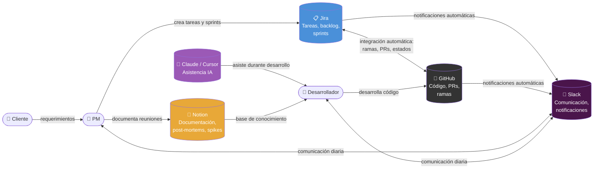
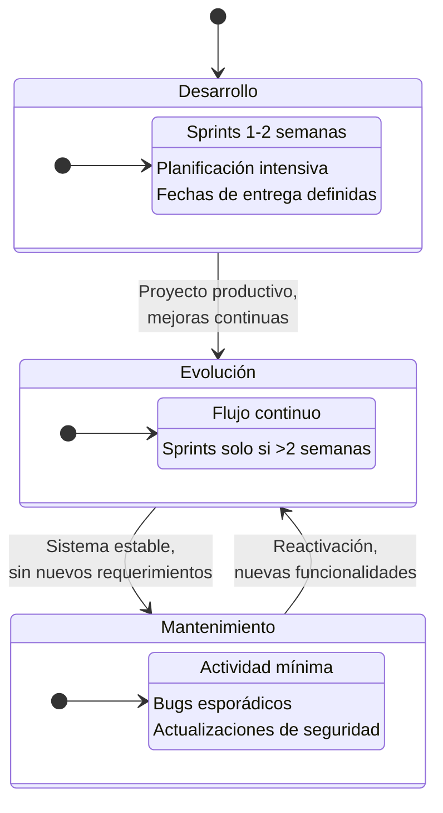
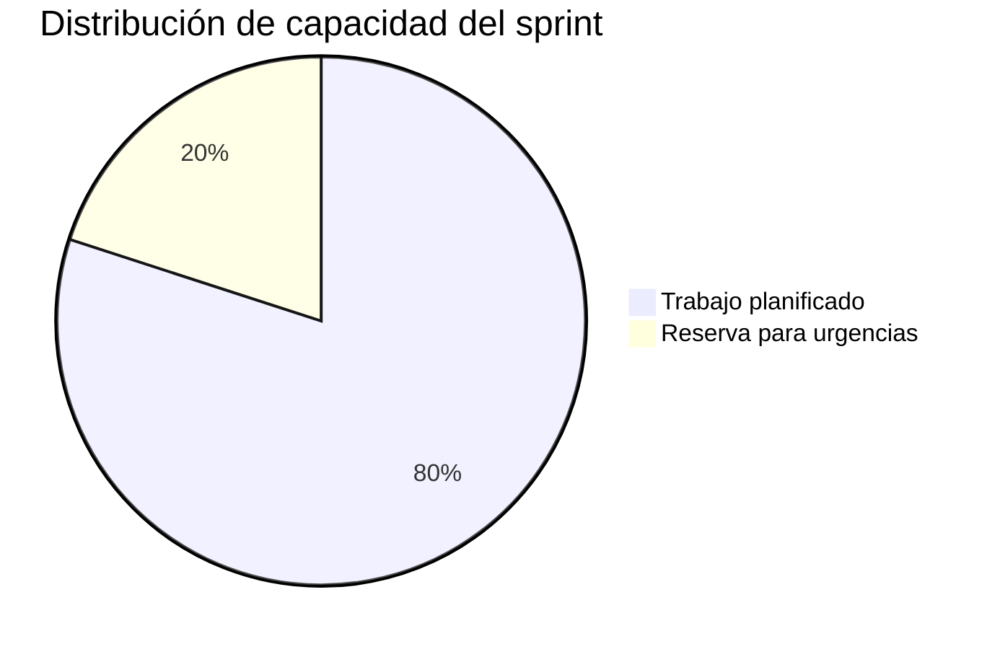

# Marco General

> [Volver al índice](README.md)

Este documento describe el marco de trabajo estándar de Tándem Digital: las herramientas que utiliza, los roles y sus responsabilidades, y los tipos de proyecto con sus metodologías asociadas.

---

## Herramientas principales

| Herramienta | Uso principal |
|-------------|---------------|
| **Jira** | Gestión de proyectos, backlog, Kanban, sprints y seguimiento de tareas. |
| **GitHub** | Control de versiones, Pull Requests (PR) e integración con Jira para automatización de estados. |
| **Slack** | Comunicación del equipo, coordinación diaria, notificaciones automáticas de Jira y GitHub, y canales organizados por proyecto. |
| **Notion** | Documentación del proyecto, actas de reuniones, post-mortems y base de conocimiento. |
| **Claude y Cursor** | Asistencia con inteligencia artificial para acelerar el desarrollo, generar código y documentación. |

### Flujo de información entre herramientas

---

## Roles y responsabilidades

### Project Manager (PM)

El PM es el **responsable principal del proyecto frente al cliente**.

**Responsabilidades:**

- Mantener una comunicación fluida y clara con el cliente.
- Obtener, aclarar y validar los requerimientos del cliente.
- Traducir los requerimientos del cliente a **tareas funcionales** en Jira (no técnicas).
- Gestionar el backlog del proyecto.
- Definir y planificar los sprints.
- Decidir qué se entrega, cuándo y en qué alcance.
- Asignar tareas a los desarrolladores.
- Controlar fechas, prioridades y avances.
- Probar funcionalmente lo desarrollado (qué ve y usa el cliente).
- Aprobar o rechazar Pull Requests desde el punto de vista funcional.
- Decidir cuándo algo está listo para subir a producción.

> En esta etapa, el rol de PM incluye tareas básicas de QA funcional.

---

### Desarrollador

El desarrollador es responsable de la **implementación técnica y la calidad del software**.

**Responsabilidades:**

- Implementar los requerimientos definidos por el PM.
- Mantener la calidad del código y respetar los estándares del proyecto.
- Evitar romper funcionalidades existentes.
- Integrar cambios de forma ordenada y controlada.
- Utilizar Inteligencia Artificial como apoyo en el desarrollo.
- Probar su propio desarrollo antes de solicitar revisión.
- Generar documentación explicando:
  - Qué se hizo
  - Qué se modificó
  - Impacto del cambio
- Adjuntar dicha documentación:
  - En el repositorio del proyecto
  - En la tarea correspondiente de Jira

---

### Líder Técnico (cuando aplica)

Interviene en:

- Conflictos complejos de merge.
- Problemas estructurales de código.
- Decisiones técnicas de mayor impacto.

> La resolución de conflictos por parte del líder técnico debe registrarse como una subtarea en Jira para mantener trazabilidad de quién se hizo cargo.

---

## Tipos de proyecto

Clasificamos los proyectos en tres tipos según la etapa en la que se encuentren:

### Desarrollo

Proyecto en construcción activa. Aún no está finalizado ni en producción. El equipo trabaja en implementar las funcionalidades principales según los requerimientos definidos. Existe una planificación intensiva con fechas de entrega establecidas y seguimiento constante del avance.

**Metodología:** Scrum con sprints de 1-2 semanas.

> Ver: [Flujo de Proyecto en Desarrollo](02-flujo-proyecto-desarrollo.md)

### Evolución

Proyecto ya productivo donde el cliente solicita nuevas funcionalidades, mejoras y corrección de bugs de forma continua. Hay desarrollo activo pero sobre una base estable en producción.

**Metodología:** Kanban. Solo se activan sprints si aparecen requerimientos grandes que superen las 2 semanas de desarrollo.

### Mantenimiento

Proyecto estable en producción sin nuevos requerimientos del cliente. El trabajo se limita a corrección de bugs esporádicos, actualizaciones de seguridad y mantenimiento general.

**Metodología:** Kanban simplificado con actividad mínima.

---

### Resumen de metodología por tipo

| Tipo | Metodología | Detalle |
|------|-------------|---------|
| **Desarrollo** | Scrum (Sprints) | Sprints con fechas de entrega definidas y planificación intensiva. |
| **Evolución** | Kanban | Flujo continuo. Sprints solo para requerimientos grandes (>2 semanas). |
| **Mantenimiento** | Kanban simplificado | Actividad mínima. Bugs esporádicos y actualizaciones de seguridad. |

### Ciclo de vida de un proyecto

El ciclo natural de un proyecto es **Desarrollo → Evolución → Mantenimiento**. Sin embargo, un proyecto en mantenimiento puede reactivarse y pasar a Evolución si surgen nuevas funcionalidades medianas o grandes, ya sea por solicitud del cliente o por iniciativa del equipo interno.

---

## Planificación de capacidad

La capacidad del sprint se distribuye para balancear trabajo planificado e imprevistos:

| Concepto | Porcentaje | Detalle |
|----------|------------|---------|
| Trabajo planificado (features + tareas técnicas) | 75-80% | Funcionalidades visibles y tareas técnicas cuando corresponda. |
| Reserva para urgencias | 20-25% | Absorbe imprevistos. Ver [Cambios de Alcance](03-gestion-cambios-alcance.md). |

Las tareas técnicas no visibles no requieren una reserva fija de capacidad. En proyectos en **Desarrollo** es buena práctica incluirlas en el sprint cuando el equipo las identifique; en **Evolución** y **Mantenimiento** se priorizan desde el backlog según necesidad. Ver [Tareas Técnicas](06-tareas-tecnicas.md).

Si durante un sprint no surgen urgencias, la reserva se puede usar para tareas técnicas del backlog o para adelantar features.

---

## Documentos relacionados

| Documento | Relación |
|-----------|----------|
| [Flujo de Proyecto en Desarrollo](02-flujo-proyecto-desarrollo.md) | Proceso detallado para proyectos en etapa de Desarrollo (Scrum). |
| [Gestión de Cambios de Alcance](03-gestion-cambios-alcance.md) | Cómo manejar cambios e imprevistos durante un sprint. |
| [Bugs en Producción](04-bugs-produccion.md) | Proceso de detección y corrección de bugs en producción. |
| [Spikes — Tareas de Investigación](05-spikes-investigacion.md) | Gestión de investigaciones técnicas y funcionales. |
| [Tareas Técnicas No Visibles](06-tareas-tecnicas.md) | Deuda técnica, refactors y mejoras internas. |
| [Plantillas de Jira](07-plantillas-jira.md) | Configuración y uso de plantillas en Jira. |
