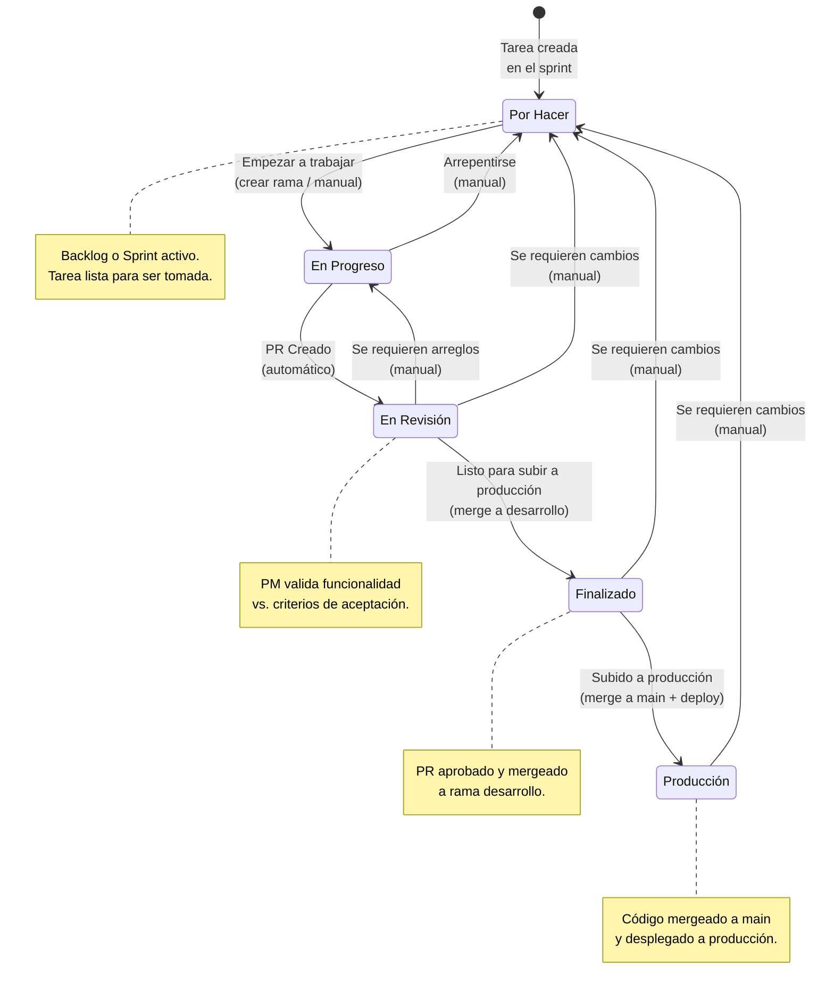
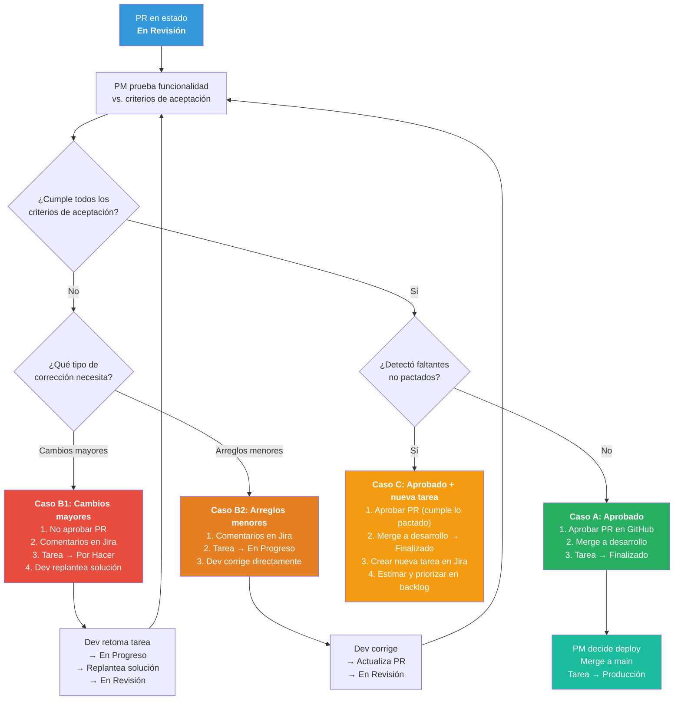
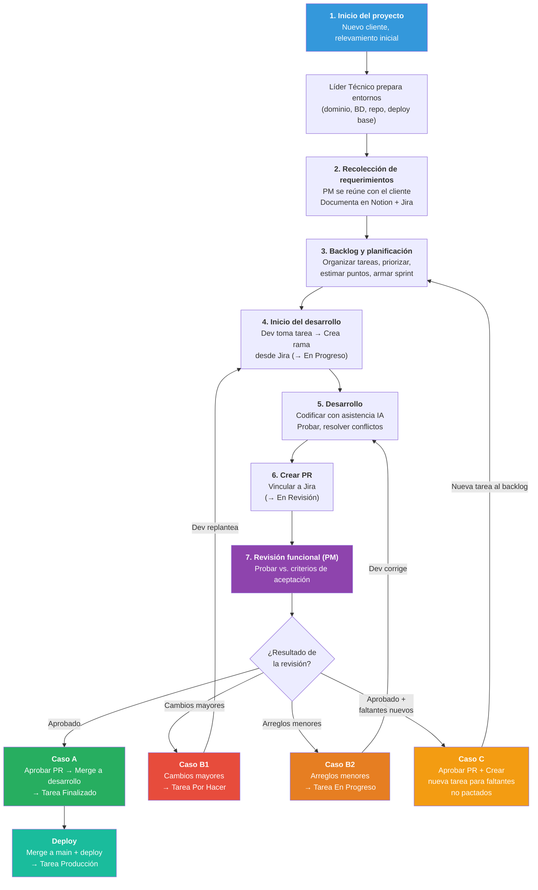
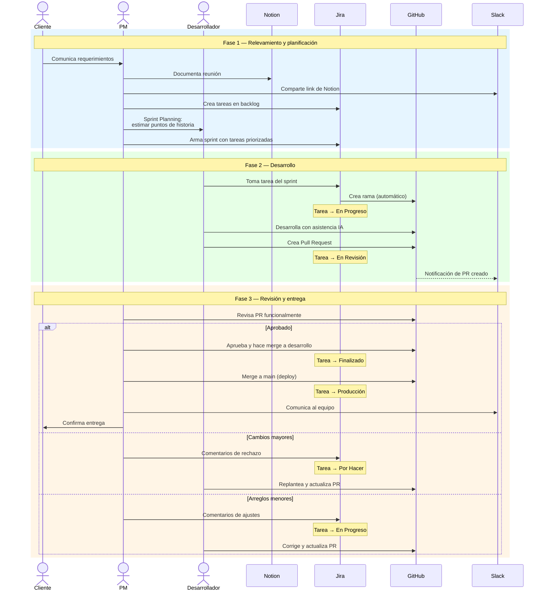

# Flujo de Proyecto en Desarrollo

> [Volver al índice](README.md) · Documento anterior: [Marco General](01-marco-general.md)

Este documento describe el flujo de trabajo completo para proyectos en etapa de **Desarrollo**, que utilizan **Scrum** con sprints de 1-2 semanas.

---

## 1. Inicio de proyecto con nuevo cliente

Una vez concretado el negocio con un nuevo cliente, se debe realizar un relevamiento inicial para identificar a grandes rasgos las necesidades y el alcance del proyecto.

Con esta información, un líder técnico debe preparar los entornos de desarrollo y producción utilizando la plantilla base del proyecto. Esto incluye:

- Configuración del dominio
- Creación de la base de datos con las tablas iniciales
- Despliegue del código base en su última versión
- Configuración del repositorio en GitHub
- Cualquier otra configuración necesaria según el proyecto

El objetivo es que el entorno quede completamente listo para que el equipo de desarrollo pueda comenzar a trabajar de inmediato, y también para que el cliente pueda visualizar avances desde etapas tempranas.

**Recomendación:** Solicitar al cliente los logos e identidad visual desde el inicio, para que el proyecto vaya tomando forma y el cliente sienta pertenencia desde las primeras entregas.

---

## 2. Recolección de requerimientos

1. El PM coordina una reunión con el cliente para relevar las necesidades del proyecto.
2. Durante la reunión, utiliza herramientas de grabación y transcripción con IA (como Fireflies) para documentar automáticamente lo conversado. Estas herramientas pueden usarse tanto en reuniones presenciales (grabando desde el teléfono) como en videollamadas por Google Meet, Slack u otras plataformas.
3. El PM actúa como analista funcional: debe saber preguntar, profundizar en los detalles y asegurarse de que no queden ambigüedades ni puntos sin definir. Es responsable de comprender tanto lo que el cliente quiere como lo que realmente necesita.
4. Propone soluciones a nivel funcional e ideas que aporten valor al proyecto, guiando al cliente cuando sea necesario.
5. Solicita aclaraciones si detecta información faltante o contradictoria.
6. Documenta los requerimientos en el **backlog de Jira**, asegurando que quede registro formal de todo lo acordado.

**¿Dónde se registra lo hablado con el cliente?** En **Notion**. El PM debe crear una página con todo lo relevado durante la reunión y luego compartir el enlace en Slack, en el canal asignado al proyecto. De esta forma, la documentación queda centralizada en Notion mientras que Slack funciona como cronología de los eventos y avances del proyecto.

---

## 3. Backlog y planificación

### Organizar el backlog

Organizar el backlog en Jira implica preparar las tareas para que estén listas para ser desarrolladas. Cada tarea debe contener toda la información necesaria para que el desarrollador pueda trabajar sin depender de aclaraciones constantes.

Una tarea bien organizada incluye:

- **Descripción clara**: Qué quiere el cliente y para qué lo necesita.
- **Alcance funcional**: Qué debe hacer la funcionalidad y qué no debe hacer (límites).
- **Archivos adjuntos**: Diseños, capturas de pantalla, documentos de referencia, links a Notion o cualquier material necesario.
- **Criterios de aceptación**: Lista de condiciones que deben cumplirse para considerar la tarea como terminada.

> **Regla práctica:** Si un desarrollador lee la tarea y tiene que preguntar algo esencial para empezar, la tarea no está lista.

### Definir prioridades

El PM define las prioridades en base a:

- **Valor para el cliente**: ¿Qué funcionalidades son más importantes o urgentes para el negocio?
- **Dependencias técnicas**: ¿Hay tareas que bloquean a otras? Esas van primero.
- **Fechas comprometidas**: ¿Hay entregas pactadas con el cliente?
- **Complejidad y riesgo**: A veces conviene adelantar tareas complejas para tener margen si surgen problemas.

En Jira, las prioridades se reflejan en el orden del backlog (las tareas más arriba son las más prioritarias) y opcionalmente con el campo de prioridad (Alta, Media, Baja).

### Armar un Sprint

La reunión de planificación del sprint (**Sprint Planning**) se realiza el **mismo día en que comienza el sprint**. En esta reunión se definen las tareas, se estiman los puntos de historia y se arma el sprint completo. Una vez finalizada la reunión, el equipo comienza a trabajar de inmediato.

**1. Definir la duración**

Los sprints tienen una duración de **1 a 2 semanas**:

- **1 semana**: Para proyectos con entregas frecuentes o equipos pequeños.
- **2 semanas**: Para proyectos con funcionalidades más complejas o equipos más grandes.

**2. Calcular la capacidad del equipo**

Antes de decidir qué tareas entran en el sprint:

1. Identificar cuántos desarrolladores estarán disponibles.
2. Restar días no laborables (feriados, vacaciones, etc.).
3. Considerar que no el 100% del tiempo es productivo (reuniones, interrupciones). Un factor realista es el **70-80%** del tiempo.

**Ejemplo:**

- 2 desarrolladores, sprint de 2 semanas (10 días hábiles cada uno).
- Tiempo total: 20 días.
- Tiempo productivo estimado (al 75%): 15 días de trabajo efectivo.

**3. Seleccionar las tareas**

Con la capacidad calculada, el PM selecciona tareas del backlog (ya priorizadas) hasta completar la capacidad del sprint. Aquí entran en juego los puntos de historia.

**4. Definir las fechas**

En Jira, al crear el sprint se definen:

- **Fecha de inicio**: Primer día de trabajo.
- **Fecha de fin**: Último día del sprint, cuando se hace la revisión y entrega.

### Puntos de historia

Los puntos de historia miden la **complejidad relativa** de una tarea, no el tiempo exacto. Se usan para estimar cuánto trabajo entra en un sprint.

**Escala recomendada (Fibonacci):**

| Puntos | Significado                                              |
| ------ | -------------------------------------------------------- |
| 1      | Tarea muy simple, cambio mínimo.                         |
| 2      | Tarea simple con algo más de trabajo.                    |
| 3      | Tarea de complejidad moderada.                           |
| 5      | Tarea compleja que requiere más análisis o desarrollo.   |
| 8      | Tarea muy compleja, puede necesitar dividirse.           |
| 13+    | Demasiado grande, debe dividirse en tareas más pequeñas. |

**¿Cuándo se definen?** Durante la **reunión de planificación del sprint** (Sprint Planning), el mismo día de inicio del sprint.

**¿Con quién?** El PM presenta las tareas y el equipo de desarrollo estima los puntos en conjunto, mediante Planning Poker o consenso rápido.

> **Importante:** Los puntos los define el equipo técnico, no el PM. El PM facilita la conversación pero no impone las estimaciones.

**Velocidad del equipo:** Se calcula con el historial de sprints anteriores. Si el equipo completó en promedio 25 puntos por sprint, ese es el número de referencia para planificar.

### Asignación de tareas

En Tándem Digital, el PM hace una **asignación inicial** pero permite flexibilidad si el equipo necesita reasignar durante el sprint.

### Criterios de aceptación

Los criterios de aceptación son una lista de condiciones verificables que definen cuándo una tarea está completa. Deben ser específicos, verificables y desde la perspectiva del usuario.

**Formato recomendado (Given-When-Then):**

```
DADO QUE [contexto inicial]
CUANDO [acción del usuario]
ENTONCES [resultado esperado]
```

**Ejemplo para "Crear formulario de login":**

```
Criterios de aceptación:

- DADO QUE el usuario está en la página de login
  CUANDO ingresa email y contraseña válidos y hace clic en "Ingresar"
  ENTONCES es redirigido al dashboard.

- DADO QUE el usuario ingresa credenciales inválidas
  CUANDO hace clic en "Ingresar"
  ENTONCES ve un mensaje de error "Email o contraseña incorrectos".

- DADO QUE el usuario deja campos vacíos
  CUANDO hace clic en "Ingresar"
  ENTONCES ve mensajes de validación en los campos requeridos.
```

**Formato alternativo (lista simple):**

```
Criterios de aceptación:
- El formulario tiene campos de email y contraseña.
- El botón "Ingresar" está deshabilitado hasta completar ambos campos.
- Muestra error si las credenciales son inválidas.
- Redirige al dashboard si las credenciales son válidas.
- Funciona correctamente en móvil y escritorio.
```

### Resumen del proceso de planificación

1. **Organizar el backlog**: Asegurar que cada tarea tenga descripción, alcance, archivos adjuntos y criterios de aceptación.
2. **Priorizar**: Ordenar las tareas según valor, dependencias y fechas.
3. **Estimar**: En la reunión de planificación, el equipo asigna puntos de historia a cada tarea.
4. **Calcular capacidad**: Determinar cuántos puntos puede completar el equipo en el sprint.
5. **Armar el sprint**: Seleccionar tareas hasta cubrir la capacidad y definir fechas.
6. **Asignar**: Distribuir las tareas entre los desarrolladores.

---

## 4. Inicio del desarrollo

1. El desarrollador accede a Jira y revisa las tareas asignadas en el sprint.
2. Para comenzar a trabajar en una tarea, debe ingresar a la misma y **crear una rama en GitHub desde Jira** (usando la integración).
3. Al crear la rama, la tarea pasa automáticamente a **En Progreso**. No es necesario cambiar el estado manualmente.
4. Si el desarrollador necesita devolver la tarea antes de crear el PR (bloqueo, falta de información, reasignación, pausa por urgencia), puede pasarla manualmente a **Por Hacer** ("Arrepentirse").
5. El desarrollador clona o actualiza su repositorio local y comienza a trabajar en la rama creada.
6. Para el desarrollo de la tarea debe utilizar herramientas de IA como asistente (Claude, Cursor).

### Estados de la tarea en Jira



### Devolver una tarea (Arrepentirse)

Un desarrollador puede devolver una tarea de **En Progreso** a **Por Hacer** en cualquier momento antes de crear el PR. Esta transición se realiza manualmente en Jira y se conoce como "Arrepentirse".

**Escenarios comunes:**

- **Bloqueo técnico**: La tarea depende de algo que aún no está disponible (otra tarea, un recurso externo, una decisión pendiente).
- **Falta de información**: Los requerimientos no son suficientes para continuar y se necesita aclaración del PM o del cliente.
- **Reasignación**: La tarea debe ser tomada por otro desarrollador (por ejemplo, por especialización o disponibilidad).
- **Pausa por urgencia**: Se interrumpe la tarea para atender un bug P0 u otra urgencia que requiere atención inmediata.

**Acción del desarrollador:**

1. Pasa la tarea a **Por Hacer** en Jira.
2. Deja un comentario en la tarea explicando el motivo de la devolución.
3. Comunica la situación en Slack, en el canal del proyecto.

> **Importante:** Devolver una tarea no es un problema. Es mejor devolver una tarea a tiempo que avanzar sin las condiciones necesarias. Lo importante es comunicar el motivo para que el PM pueda tomar acción.

---

## 5. Desarrollo y responsabilidades del desarrollador

El desarrollador es responsable de la calidad, funcionamiento y mantenibilidad del código que produce.

**Durante el desarrollo debe:**

- Revisar y comprender el código generado (ya sea propio o asistido por IA).
- Modificar y ajustar el código según el objetivo de la tarea.
- Verificar que el código siga las reglas y estándares del proyecto.
- Reutilizar funciones y componentes existentes cuando corresponda, evitando duplicación.
- Asegurar que el código sea limpio, legible y mantenible.

**Pruebas:**

- Probar la funcionalidad desarrollada según los criterios de aceptación definidos en la tarea.
- Verificar el correcto funcionamiento en los escenarios esperados y en casos de error.

### Resolución de conflictos en el código

Al crear el PR, si GitHub indica que existen conflictos con la rama de destino, es responsabilidad del desarrollador resolverlos antes de que el PR pueda ser revisado.

**Para resolver los conflictos:**

1. Actualizar la rama local con los últimos cambios de la rama de destino (generalmente `desarrollo`).
2. Resolver los conflictos en la propia rama, asegurándose de no perder cambios de ninguna de las partes.
3. Realizar un nuevo commit con la resolución y actualizar el PR.

> **Importante:** Los conflictos siempre se resuelven en la rama del desarrollador, nunca directamente en la rama de destino.

**Conflictos complejos:**

Si el desarrollador no puede resolver el conflicto por su cuenta (por ejemplo, si afecta código que no conoce o involucra decisiones técnicas):

- Notifica al líder técnico a través de Slack en el canal del proyecto.
- Se crea una **subtarea** en Jira vinculada a la tarea original, asignada al líder técnico, describiendo el conflicto a resolver.
- El líder técnico resuelve el conflicto en conjunto con el desarrollador, siempre trabajando sobre la rama del desarrollador.
- Una vez resuelto, se cierra la subtarea y el PR queda listo para revisión.

---

## 6. Finalización del desarrollo

Una vez que el desarrollador considera que la tarea está completa:

### 6.1 Verificación final

- Confirmar que la funcionalidad cumple con todos los criterios de aceptación.
- Realizar una revisión final del código: limpieza, estándares y reutilización de componentes.
- Probar los escenarios principales y casos de error.

### 6.2 Documentación

- Generar un archivo Markdown (.md) explicando la solución implementada. Este documento puede crearse con ayuda de IA.

### 6.3 Crear Pull Request (PR)

El desarrollador crea un Pull Request en GitHub desde su rama hacia la rama de destino (generalmente `desarrollo`).

Para que el PR se vincule correctamente con Jira, debe crearse de alguna de estas formas:

- **Desde Jira**: Usar la opción de crear PR desde la tarea, lo que genera el vínculo automáticamente.
- **Desde GitHub**: Incluir el ID de la tarea de Jira en el nombre del PR (por ejemplo: `PROJ-123 Implementar formulario de login`).

En la descripción del PR, incluir un resumen de los cambios realizados.

**Acciones automáticas al crear el PR:**

- El PR se vincula automáticamente a la tarea en Jira.
- La tarea pasa automáticamente a estado **En Revisión**. No es necesario cambiar el estado manualmente.

---

## 7. Revisión funcional (PM)

El PM es responsable de revisar las tareas que se encuentran en estado **En Revisión**. Su rol es validar funcionalmente el resultado del desarrollo: probar exactamente lo que verá el cliente.

**El PM debe:**

- Revisar los Pull Requests pendientes de aprobación.
- Probar la funcionalidad desarrollada desde la perspectiva del usuario.
- Validar que se cumplan todos los criterios de aceptación definidos en la tarea.

### Caso A: Aprobado

Si la funcionalidad cumple con todos los criterios de aceptación:

1. El PM aprueba el PR en GitHub.
2. Realiza el merge a la rama **desarrollo**.
3. Al hacer el merge, la tarea pasa automáticamente a estado **Finalizado** en Jira.
4. Cuando el PM decide que los cambios están listos para producción, realiza el merge a la rama **main** y despliega. La tarea pasa a estado **Producción**.

> **Finalizado** = código mergeado a `desarrollo`. **Producción** = código mergeado a `main` y desplegado.

### Caso B1: Rechazado — Se requieren cambios mayores

Si el PM detecta que la tarea necesita **replantear el enfoque** o tiene problemas significativos que requieren volver a analizar la solución:

1. El PM **no aprueba** el PR.
2. Deja comentarios claros en la tarea de Jira indicando:
   - Qué está funcionando mal
   - Qué falta según lo pactado
   - Qué cambios de enfoque se necesitan
3. Pasa la tarea a estado **Por Hacer**.
4. Los puntos de historia se mantienen igual, ya que el alcance no cambió.

**Acción del desarrollador:**

- Toma nuevamente la tarea y la pasa manualmente a **En Progreso**.
- Replantea la solución y realiza los cambios necesarios.
- Crea un nuevo PR o actualiza el existente (la tarea pasa a **En Revisión**).

### Caso B2: Rechazado — Se requieren arreglos menores

Si el PM detecta **correcciones menores** que no requieren replantear la solución (ajustes visuales, textos, validaciones puntuales):

1. El PM deja comentarios en la tarea de Jira indicando los arreglos específicos.
2. Pasa la tarea a estado **En Progreso** directamente (no a Por Hacer).
3. Los puntos de historia se mantienen igual.

**Acción del desarrollador:**

- Realiza las correcciones menores directamente.
- Actualiza el PR (la tarea vuelve a **En Revisión**).

### Caso C: Se detectan faltantes no pactados

Si durante la revisión el PM detecta que falta algo que **no estaba definido en los criterios de aceptación originales**:

1. El PM **aprueba el PR** con lo desarrollado, ya que cumple con lo pactado.
2. Crea una **nueva tarea** en Jira con el requerimiento adicional.
3. La nueva tarea se estima con sus propios puntos de historia y se prioriza en el backlog.

> **Importante:** No se debe rechazar una tarea por faltantes que no fueron definidos desde el inicio. Esto protege al desarrollador y mantiene la trazabilidad del trabajo.

### Diagrama del proceso de revisión funcional



### Deploy a producción y transiciones post-merge

**Finalizado → Producción:**

Cuando el PM decide que los cambios están listos para producción:

1. Realiza el merge de `desarrollo` a `main`.
2. Despliega a producción.
3. La tarea pasa a estado **Producción** en Jira (manualmente).
4. Comunica al cliente la entrega.

> El paso de Finalizado a Producción no tiene que ser inmediato. El PM puede acumular varias tareas en Finalizado y desplegarlas juntas en un release.

**Finalizado → Por Hacer (se requieren cambios):**

Si después de mergear a `desarrollo` se detectan problemas que no se vieron en la revisión del PR:

1. El PM pasa la tarea a **Por Hacer** con un comentario explicando qué problemas se encontraron.
2. El desarrollador toma la tarea, la pasa a **En Progreso** y realiza las correcciones.
3. Se sigue el flujo normal (PR → En Revisión → Finalizado).

**Producción → Por Hacer (se requieren cambios):**

Si después del deploy a producción se detectan problemas con la funcionalidad entregada:

1. El PM evalúa la gravedad del problema.
2. Si es un bug crítico (P0), se sigue el flujo de [Bugs en Producción](04-bugs-produccion.md).
3. Si es un ajuste funcional, el PM pasa la tarea a **Por Hacer** y el desarrollador la retoma en el siguiente sprint o de inmediato según la prioridad.

---

## 8. Resumen del flujo de trabajo

El proceso de desarrollo en Tándem Digital sigue un ciclo claro y repetible:

| Paso                 | Acción                                                                                                                   |
| -------------------- | ------------------------------------------------------------------------------------------------------------------------ |
| **1. Relevamiento**  | El PM se reúne con el cliente, documenta los requerimientos y los registra en Jira.                                      |
| **2. Planificación** | Se organiza el backlog, se estiman las tareas con el equipo y se arma el sprint.                                         |
| **3. Desarrollo**    | El desarrollador toma la tarea, crea su rama, desarrolla con asistencia de IA y es responsable de la calidad del código. |
| **4. Entrega**       | Se crea el PR, se resuelven conflictos si los hay, y se envía a revisión.                                                |
| **5. Revisión**      | El PM valida funcionalmente. Aprueba, solicita arreglos menores o rechaza con cambios mayores.                           |
| **6. Deploy**        | Merge a `desarrollo` → **Finalizado**. Merge a `main` + deploy → **Producción**.                                        |

### Diagrama del flujo completo



### Interacción entre roles y herramientas



### Claves para el éxito

- **Documentación desde el inicio**: Todo lo hablado con el cliente debe quedar registrado en Notion y comunicado en Slack.
- **Tareas bien definidas**: Una tarea con descripción clara, alcance y criterios de aceptación reduce fricciones y retrabajos.
- **Comunicación constante**: Slack es el canal de coordinación diaria; los bloqueos o dudas deben comunicarse de inmediato.
- **Responsabilidad compartida**: El PM es responsable de la definición y validación; el desarrollador es responsable de la calidad técnica.
- **Mejora continua**: La velocidad del equipo y las métricas de cada sprint permiten ajustar y mejorar el proceso con el tiempo.

---

## Situaciones especiales

Durante el desarrollo de un proyecto pueden surgir situaciones que requieren procesos específicos. Cada una está documentada en detalle:

| Situación                                            | Documento                                                      |
| ---------------------------------------------------- | -------------------------------------------------------------- |
| Cambios de alcance durante un sprint                 | [Gestión de Cambios de Alcance](03-gestion-cambios-alcance.md) |
| Bugs detectados en producción                        | [Bugs en Producción](04-bugs-produccion.md)                    |
| Incertidumbre técnica o funcional que impide estimar | [Spikes — Tareas de Investigación](05-spikes-investigacion.md) |
| Deuda técnica, refactors y mejoras internas          | [Tareas Técnicas No Visibles](06-tareas-tecnicas.md)           |
