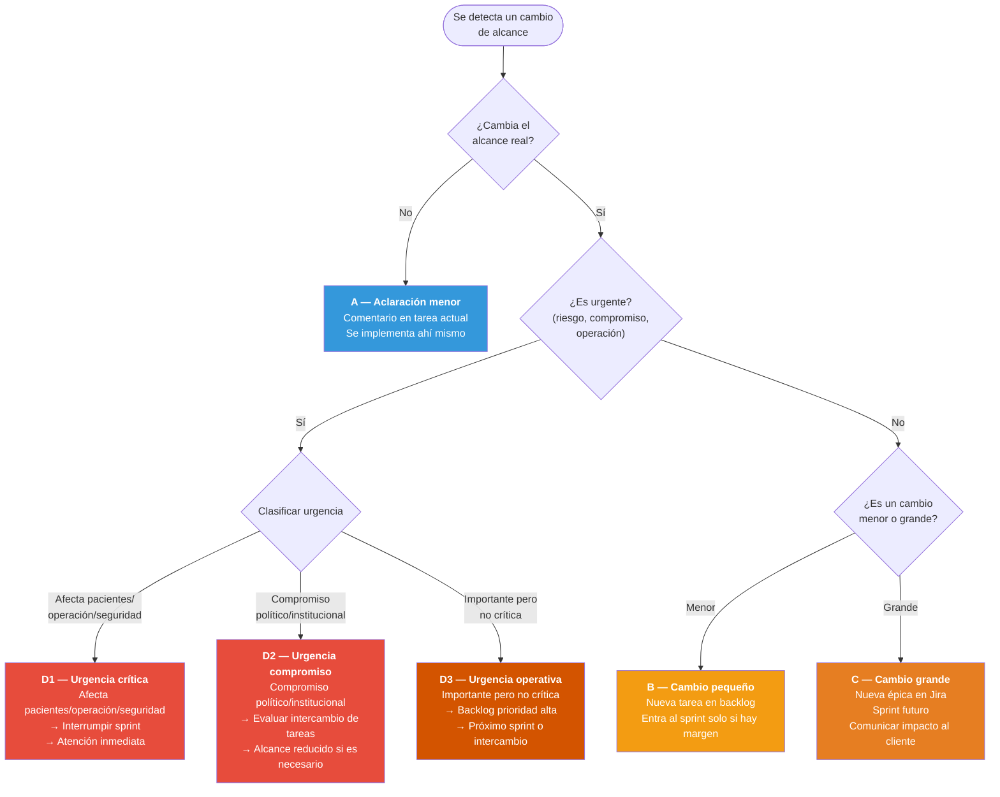
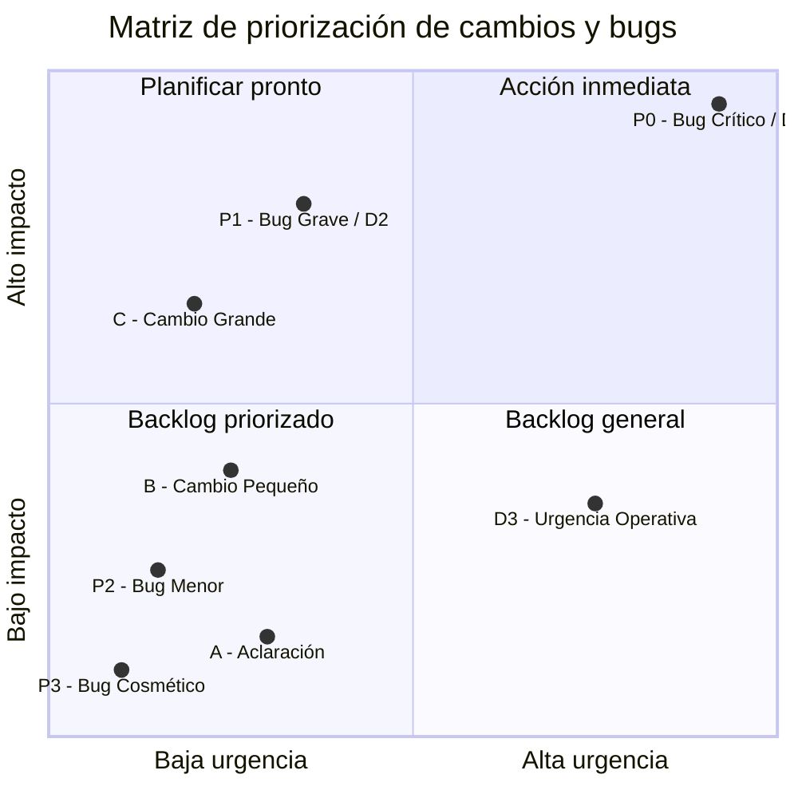

# Gestión de Cambios de Alcance Durante un Sprint

> [Volver al índice](README.md) · Flujo principal: [Proyecto en Desarrollo](02-flujo-proyecto-desarrollo.md)

Este documento define cómo debe proceder el equipo de Tándem Digital ante **cambios de alcance que surgen durante un sprint en curso**, con el objetivo de proteger la planificación, la calidad del desarrollo y la relación con el cliente.

---

## Contexto de Tándem Digital

Dado que el 90% de los proyectos de Tándem Digital son del sector salud y gobierno, se reconoce que las urgencias son frecuentes y muchas veces inevitables. Situaciones críticas que afectan la atención de pacientes o compromisos institucionales requieren respuesta inmediata.

El proceso contempla esta realidad y ofrece flexibilidad para atender situaciones urgentes, pero toda interrupción debe registrarse para medir su impacto y mejorar la planificación futura.

---

## Principio base

> Un sprint no se modifica a la ligera, pero se adapta cuando la situación lo requiere. Todo cambio de alcance impacta en tiempo, foco y calidad.

El **PM es el único responsable** de evaluar, decidir y comunicar cómo se maneja un cambio de alcance. Ningún otro rol puede comprometer el sprint sin su aprobación.

---

## 1. Detección del cambio

Un cambio de alcance puede surgir desde:

- **El cliente**: Solicita algo nuevo o diferente a lo pactado.
- **El PM**: Al profundizar en el requerimiento, detecta que falta definir algo.
- **El desarrollador**: Durante la implementación, identifica escenarios no contemplados.
- **El PM durante la revisión funcional**: Al probar, detecta necesidades adicionales.

**Reglas iniciales:**

- El cambio **no se desarrolla automáticamente**.
- El cambio **no se agrega de forma informal** (ni por Slack, ni de palabra).
- Todo cambio debe evaluarse y documentarse antes de ejecutarse.

---

## 2. Clasificación del cambio

El PM debe clasificar el cambio en una de las siguientes categorías:

### A. Aclaración menor (no cambia el alcance real)

Son ajustes que no modifican la funcionalidad ni el esfuerzo requerido. Estaban implícitos en el requerimiento original.

**Ejemplos:**

- Corrección de textos o etiquetas.
- Ajustes visuales mínimos (espaciado, alineación).
- Comportamientos que ya se deducían del requerimiento.

**Acción:**

- Se documenta como comentario en la tarea actual de Jira.
- El desarrollador lo implementa dentro de la misma tarea.
- No se crea nueva tarea.
- No impacta el sprint ni los puntos de historia.

---

### B. Cambio pequeño fuera del alcance original

Son cambios funcionales menores que no estaban contemplados en los criterios de aceptación, pero que no representan un desarrollo extenso.

**Ejemplos:**

- Agregar un campo nuevo a un formulario.
- Validaciones adicionales no previstas.
- Ajustes funcionales leves que el cliente solicita durante el sprint.

**Acción:**

- El PM crea una **nueva tarea en Jira** con descripción y criterios de aceptación.
- La tarea se deja en el **Backlog**, no en el sprint actual.
- Por defecto **no entra en el sprint en curso**.
- Solo puede entrar al sprint si:
    - Hay margen real de tiempo (el equipo va adelantado).
    - Se quita otra tarea del sprint para compensar.
    - La decisión queda documentada en Jira y se comunica al equipo.

---

### C. Cambio grande o nuevo requerimiento

Son cambios que implican esfuerzo significativo, afectan múltiples partes del sistema o introducen funcionalidad completamente nueva.

**Ejemplos:**

- Nueva funcionalidad no contemplada inicialmente.
- Cambio en la lógica de negocio que afecta lo ya desarrollado.
- Modificaciones que impactan múltiples pantallas o procesos.

**Acción:**

- Se crea una nueva tarea o épica en Jira.
- Se estima con el equipo en la próxima reunión de planificación.
- Se planifica para un sprint futuro.
- El PM comunica al cliente el impacto en tiempos y, si corresponde, en costos.

---

### D. Urgencias

Dado el contexto de salud y gobierno, las urgencias se dividen en tres niveles:

#### D1. Urgencia crítica (afecta atención de pacientes o hay riesgo real)

Son situaciones donde hay impacto directo en la operación del cliente o riesgo para los usuarios finales.

**Ejemplos:**

- Sistema caído que impide la atención.
- Error en turnos o datos clínicos.
- Falla de seguridad o pérdida de datos.

**Acción:**

- Se interrumpe el sprint. Se atiende de inmediato.
- Se crea una tarea de tipo **Bug Crítico** en Jira con la etiqueta `urgencia-critica`.
- El PM comunica al equipo y redistribuye las tareas si es necesario.
- Se documenta el impacto en el sprint en la tarea pausada (en Jira): agregar un comentario explicando que fue pausada, por qué (qué urgencia la desplazó) y un link a la tarea urgente.

> **Relación con bugs:** Un bug P0 en producción se trata como urgencia crítica D1. Ver [Bugs en Producción](04-bugs-produccion.md).

#### D2. Urgencia por compromiso político o institucional

Son situaciones donde hay una promesa o fecha inamovible con autoridades, pero no hay riesgo operativo inmediato.

**Ejemplos:**

- Demostración al ministro o autoridades.
- Fecha de lanzamiento comprometida públicamente.
- Auditoría o revisión externa programada.

**Acción:**

- El PM evalúa qué tareas del sprint pueden pausarse o intercambiarse.
- Se negocia con el cliente un alcance reducido si es necesario (entregar lo esencial).
- Se crea la tarea en Jira con la etiqueta `urgencia-compromiso`.
- Se documenta qué se pausó y por qué.

### Árbol de decisión para clasificar cambios de alcance

#### D3. Urgencia operativa (importante pero no crítica)

Son situaciones importantes para el cliente pero que no representan un riesgo inmediato ni un compromiso institucional.

**Ejemplos:**

- Reporte nuevo solicitado con urgencia.
- Ajuste de funcionalidad que el cliente necesita pronto.
- Mejora que facilita el trabajo diario del usuario.

**Acción:**

- Entra al backlog con **prioridad alta**.
- Se planifica para el próximo sprint, o se intercambia por otra tarea del sprint actual si hay acuerdo.
- Se crea la tarea en Jira con la etiqueta `urgencia-operativa`.

---

## 3. Reserva de capacidad para urgencias

Dado que las urgencias son frecuentes, se recomienda **planificar los sprints al 75-80% de la capacidad** del equipo. Esto deja un margen para atender imprevistos sin desbordar el sprint.

Si durante un sprint no surgen urgencias, el equipo puede tomar tareas adicionales del backlog.

---

## 4. Decisión y registro

Toda decisión sobre cambios de alcance debe quedar registrada para mantener la trazabilidad.

**En Jira:**

- Agregar un comentario claro en la tarea afectada o en la nueva tarea, explicando:
    - Qué cambió respecto al alcance original.
    - Por qué surgió el cambio (solicitud del cliente, detección interna, urgencia, etc.).
    - Qué decisión se tomó (se agrega al sprint, se deja en backlog, se planifica a futuro).
- Usar las etiquetas correspondientes:
    - `cambio-alcance`: Para cambios de alcance generales.
    - `urgencia-critica`: Para urgencias que afectan operación o pacientes.
    - `urgencia-compromiso`: Para urgencias por compromisos políticos o institucionales.
    - `urgencia-operativa`: Para urgencias importantes pero no críticas.

**Comunicación al cliente:**

- Si el cambio impacta en fechas de entrega o en el costo del proyecto, el PM debe comunicarlo al cliente de forma clara y oportuna.
- Esta comunicación debe quedar documentada en **Notion** y referenciada en **Slack** en el canal del proyecto.

---

## 5. Qué NO se debe hacer

- **No agregar cambios "ya que estamos"**: Cada cambio tiene un costo, aunque parezca pequeño.
- **No modificar alcance sin ticket**: Todo cambio debe tener su tarea en Jira.
- **No presionar al desarrollador minimizando el cambio**: Frases como "es solo un detallito" generan trabajo no planificado y afectan la calidad.
- **No romper el sprint sin comunicarlo**: Si el sprint se ve afectado, debe quedar documentado y comunicado al equipo.
- **No tratar todo como urgencia crítica**: Clasificar correctamente permite priorizar lo que realmente importa.

Estas prácticas degradan el proceso, generan desorden y afectan la confianza del equipo.

---

## 6. Buenas prácticas recomendadas

- **Usar etiquetas en Jira**: Aplicar las etiquetas correspondientes a todas las tareas que surjan de cambios de alcance o urgencias.
- **Registrar todos los cambios detectados**: Aunque no se implementen de inmediato, deben quedar documentados en el backlog.
- **Revisarlos en la retrospectiva**: Al final del sprint, analizar cuántos cambios y urgencias surgieron, de dónde vinieron y cómo afectaron la planificación.
- **Medir las interrupciones**: Llevar un registro de cuántas veces se interrumpe el sprint. Esto da datos concretos para negociar mejor con los clientes o ajustar expectativas.
- **Ajustar la planificación futura**: Si un proyecto tiene muchas urgencias recurrentes, puede ser señal de que necesita mayor capacidad asignada o un modelo de trabajo diferente (por ejemplo, Kanban en lugar de Sprints).

---

## Resumen

| Tipo | Descripción | Acción |
|------|-------------|--------|
| **A. Aclaración menor** | No cambia alcance real | Comentario en tarea actual, se implementa ahí mismo. |
| **B. Cambio pequeño** | Fuera de alcance pero menor | Nueva tarea en backlog. Entra al sprint solo si hay margen. |
| **C. Cambio grande** | Esfuerzo significativo | Nueva tarea/épica. Se planifica para sprint futuro. |
| **D1. Urgencia crítica** | Riesgo real, pacientes afectados | Se interrumpe el sprint. Atención inmediata. |
| **D2. Urgencia compromiso** | Fecha inamovible con autoridades | Se evalúa intercambio de tareas. Alcance reducido si es necesario. |
| **D3. Urgencia operativa** | Importante pero no crítica | Backlog con prioridad alta. Próximo sprint o intercambio. |

**El objetivo es mantener el foco del equipo y la calidad del desarrollo, sin perder la capacidad de responder cuando realmente importa.**

### Matriz de priorización: Impacto vs. Urgencia

---

## Documentos relacionados

| Documento | Relación |
|-----------|----------|
| [Bugs en Producción](04-bugs-produccion.md) | Un bug P0 se trata como urgencia crítica D1. Un bug P1 puede ser D2 o D3. |
| [Tareas Técnicas No Visibles](06-tareas-tecnicas.md) | Las tareas técnicas urgentes se clasifican según D1, D2 o D3. |
| [Spikes — Investigación](05-spikes-investigacion.md) | Una spike puede revelar cambios de alcance que se gestionan según este documento. |
