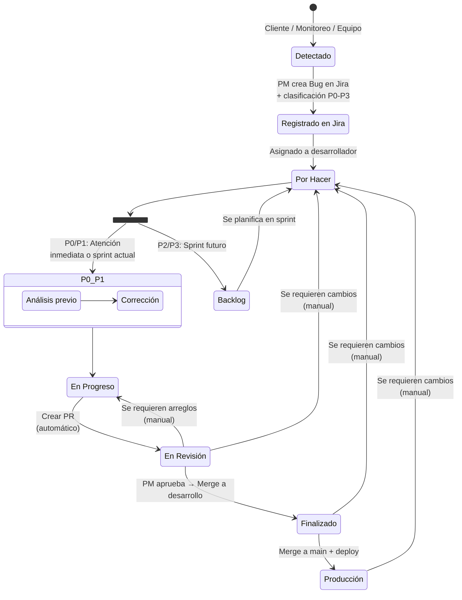
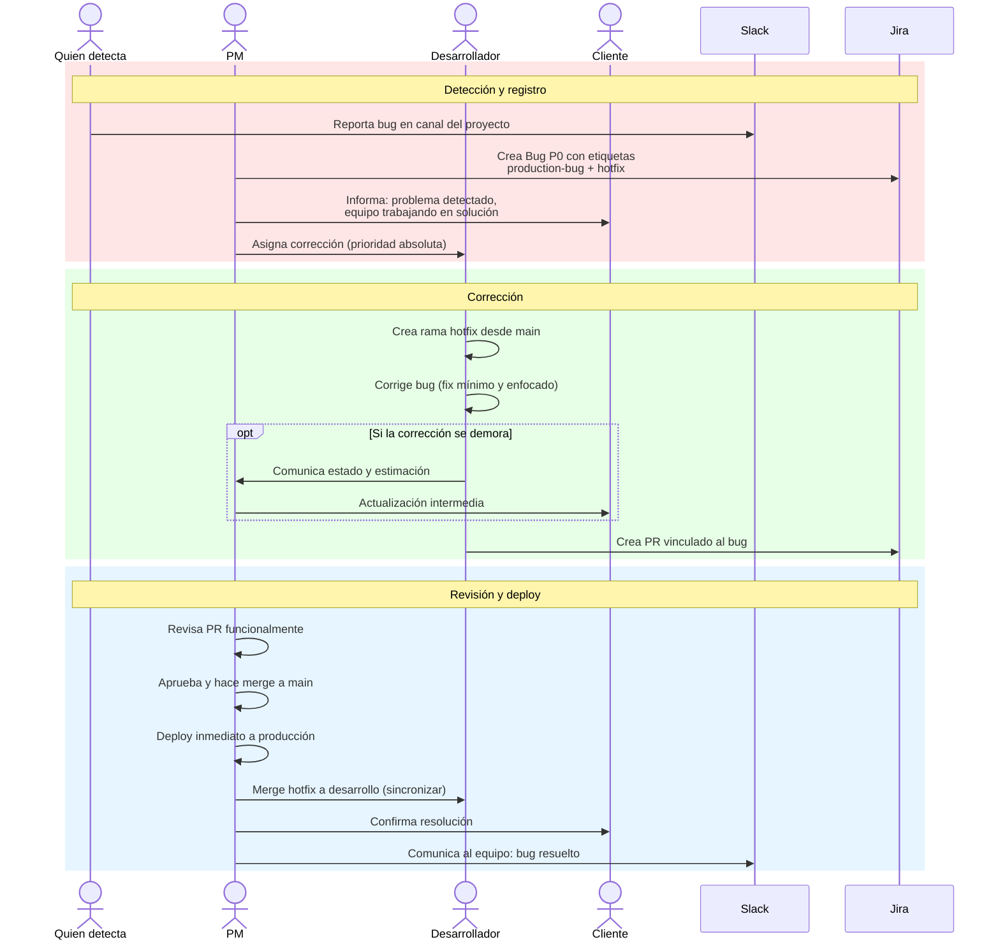
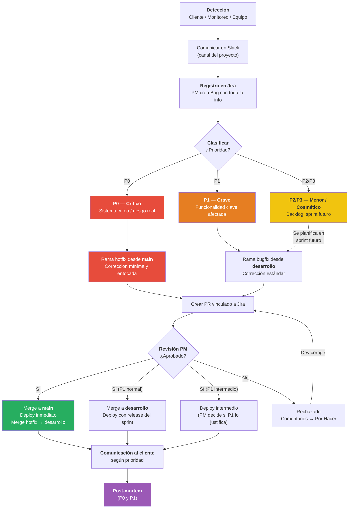

# Bugs Detectados en Producción

> [Volver al índice](README.md) · Flujo principal: [Proyecto en Desarrollo](02-flujo-proyecto-desarrollo.md)

Este documento define cómo debe proceder el equipo de Tándem Digital ante la **detección de bugs en producción**, asegurando una respuesta rápida, controlada y trazable, sin comprometer la estabilidad del sistema.

---

## Principio base

> Un bug en producción es prioridad, pero no todos los bugs son urgentes. La respuesta debe ser proporcional al impacto real.

El objetivo es:

- Restaurar el servicio cuando el impacto es crítico.
- Corregir el problema sin introducir nuevos errores.
- Mantener control y trazabilidad en todo el proceso.
- Documentar lo ocurrido para prevenir recurrencias.

El **PM coordina** el proceso: decide la prioridad, comunica al cliente y determina cuándo se despliega la corrección. El **desarrollador ejecuta** la solución técnica con la calidad y responsabilidad habituales. El **líder técnico** interviene cuando la complejidad o el riesgo lo requieren.

---

## 1. Detección del bug

Un bug en producción puede ser detectado por:

- **El cliente**: Reporta el problema directamente al PM por cualquier canal (email, Slack, reunión, teléfono).
- **Usuarios finales**: Reportan a través del cliente o de canales de soporte.
- **Monitoreo automático**: Alertas del sistema, logs de error, métricas de performance.
- **Equipo interno de Tándem Digital**: Un desarrollador, PM o líder técnico detecta el problema durante pruebas, demostraciones o uso del sistema.

**Reglas iniciales:**

- **No se corrige sin ticket en Jira.** Aunque el bug sea evidente y la corrección parezca simple, primero se registra.
- **No se modifica producción de forma directa.** Toda corrección pasa por el flujo de ramas y Pull Request.
- **No se mezcla la corrección con desarrollo nuevo.** El fix debe ser lo más acotado posible al problema reportado.

**Canal de comunicación inicial:**

Cuando se detecta un bug, se comunica inmediatamente en **Slack**, en el canal del proyecto correspondiente. Esto alerta al PM y al equipo. El PM evalúa la situación y decide los pasos a seguir.

---

## 2. Registro del bug en Jira

El PM (o quien detecte el bug, con conocimiento del PM) crea una tarea en Jira de tipo **Bug** con la siguiente información:

### Campos obligatorios

- **Título**: Descripción breve y clara del problema.
    - Correcto: `El formulario de turnos no guarda la fecha seleccionada`
    - Incorrecto: `Error en turnos`
- **Descripción**: Explicación detallada del problema, incluyendo:
    - Qué está pasando (comportamiento actual).
    - Qué debería pasar (comportamiento esperado).
    - Módulo o flujo afectado.
    - Entorno donde se detectó (producción, staging, etc.).
    - Impacto en el negocio o en los usuarios.
- **Pasos para reproducir**: Secuencia clara de acciones para replicar el bug. Si no se pueden determinar al momento del registro, indicar "Pendiente de reproducción".
- **Evidencia**: Capturas de pantalla, videos, logs de error o cualquier material que ayude a entender y reproducir el problema.
- **Prioridad**: Según la clasificación del bug (P0, P1, P2, P3).
- **Etiqueta**: `production-bug`.

### Campos opcionales

- **Épica vinculada**: Si el bug está relacionado con una funcionalidad específica.
- **Etiqueta adicional**: `hotfix` si requiere despliegue urgente.

### Ejemplo completo de un Bug en Jira

```
Título: El formulario de turnos no guarda la fecha seleccionada

Tipo: Bug
Prioridad: P1 (Grave)
Etiquetas: production-bug
Épica: Módulo de Turnos
Asignado a: [Desarrollador]

Descripción:
Comportamiento actual:
Cuando un usuario selecciona una fecha en el formulario de turnos y
hace clic en "Guardar", el turno se crea pero con la fecha de hoy
en lugar de la fecha seleccionada.

Comportamiento esperado:
El turno debe guardarse con la fecha que el usuario seleccionó
en el calendario.

Módulo afectado: Turnos > Crear nuevo turno
Entorno: Producción
Impacto: Los turnos se están agendando en fechas incorrectas.
El personal administrativo debe corregirlos manualmente.
Afecta a todos los usuarios del módulo de turnos.

Pasos para reproducir:
1. Ir a Turnos > Nuevo turno
2. Seleccionar cualquier fecha futura en el calendario
3. Completar los demás campos
4. Hacer clic en "Guardar"
5. Verificar que la fecha guardada es la de hoy, no la seleccionada

Evidencia:
- Captura adjunta mostrando fecha seleccionada vs fecha guardada
- Log de consola adjunto con el payload enviado al backend
```

---

## 3. Clasificación del bug

El PM clasifica el bug según su impacto. Si el PM no puede evaluar la gravedad técnica por sí solo, consulta al desarrollador asignado o al líder técnico antes de clasificar.

### P0 – Bug crítico

El sistema no funciona o hay riesgo directo para la operación del cliente, los datos o los usuarios finales.

**Ejemplos (contexto salud y gobierno):**

- Sistema completamente caído o inaccesible.
- Imposibilidad de realizar operaciones esenciales (agendar turnos, registrar pacientes, generar facturas).
- Pérdida o corrupción de datos.
- Falla de seguridad que expone información sensible (datos de pacientes, credenciales).
- Error en facturación que genera documentos fiscales incorrectos.

**Acción:**

1. **Prioridad absoluta.** Se interrumpe el trabajo actual del desarrollador asignado.
2. El PM comunica la situación al cliente de inmediato, informando que se está trabajando en la solución.
3. El desarrollador crea una rama de **hotfix** desde `main`.
4. La corrección debe ser **lo más acotada posible**: solo se corrige el bug, sin refactorizar ni agregar mejoras.
5. Deploy urgente a producción una vez aprobado el fix.
6. Se documenta el impacto en el sprint: si había una tarea en progreso que se pausó, se agrega un comentario en esa tarea explicando qué la desplazó y un link al bug.

> **Relación con cambios de alcance:** Un bug P0 se trata como una **urgencia crítica (D1)**. Se aplican las mismas reglas: se interrumpe el sprint, se documenta el impacto y se registra qué tarea se pausó. Ver [Gestión de Cambios de Alcance](03-gestion-cambios-alcance.md).

---

### P1 – Bug grave

Una funcionalidad clave no funciona correctamente, pero existe un workaround o el impacto no es total.

**Ejemplos:**

- Una funcionalidad importante falla bajo ciertas condiciones, pero hay una alternativa temporal.
- El problema afecta a muchos usuarios pero no impide operar completamente.
- Un reporte genera datos incorrectos pero el sistema sigue funcionando.
- Un flujo funciona parcialmente (por ejemplo, se pueden crear turnos pero no editarlos).

**Acción:**

1. **Prioridad alta.** Se corrige en el sprint actual si hay capacidad, o se planifica como primera prioridad del próximo sprint.
2. El PM comunica al cliente el problema detectado, el workaround disponible (si lo hay) y el plan de corrección con fechas estimadas.
3. El desarrollador sigue el flujo estándar de corrección (rama desde `desarrollo`, PR, revisión).
4. El deploy puede esperar al release normal del sprint, salvo que el PM decida que se justifica un deploy intermedio.

> **Relación con cambios de alcance:** Un bug P1 puede tratarse como una **urgencia operativa (D3)** o como una **urgencia por compromiso (D2)** si afecta una demostración o entrega pactada. Ver [Gestión de Cambios de Alcance](03-gestion-cambios-alcance.md).

---

### P2 – Bug menor

El problema existe pero su impacto es bajo y no afecta la operación normal del sistema.

**Ejemplos:**

- Errores visuales o de maquetación que no impiden el uso.
- Textos o etiquetas incorrectas.
- Comportamiento inesperado en casos borde poco frecuentes.
- Funcionalidad secundaria con un defecto menor.

**Acción:**

1. Se registra en el **backlog** con prioridad normal.
2. Se planifica para un sprint futuro según la prioridad general del backlog.
3. **No interrumpe** el sprint actual ni el flujo de trabajo.
4. No requiere comunicación especial al cliente, salvo que este lo haya reportado (en cuyo caso se le informa que fue registrado y se corregirá en una próxima entrega).

---

### P3 – Bug cosmético o trivial

Defectos mínimos que no afectan la funcionalidad ni la experiencia del usuario de forma significativa.

**Ejemplos:**

- Un pixel de diferencia en un borde.
- Un tooltip con texto incompleto.
- Un ordenamiento ligeramente diferente al esperado en una lista no crítica.

**Acción:**

1. Se registra en el backlog con prioridad baja.
2. Se corrige cuando haya disponibilidad o se agrupa con otras correcciones menores.
3. No requiere comunicación al cliente.

---

### Resumen de clasificación

| Prioridad | Nombre | Impacto | Respuesta | Etiquetas |
|-----------|--------|---------|-----------|-----------|
| **P0** | Crítico | Sistema caído o inoperable | Inmediata. Hotfix urgente. | `production-bug`, `hotfix` |
| **P1** | Grave | Funcionalidad clave afectada | Sprint actual o inmediato. | `production-bug` |
| **P2** | Menor | Impacto bajo, no impide operar | Backlog, sprint futuro. | `production-bug` |
| **P3** | Cosmético | Defecto mínimo, casi imperceptible | Backlog, baja prioridad. | `production-bug` |

---

## 4. Análisis previo a la corrección

Antes de empezar a corregir el bug, el desarrollador (con apoyo del líder técnico si es necesario) debe realizar un análisis breve para entender el problema y definir la estrategia de corrección.

**Preguntas que debe responder el análisis:**

- **¿Es un bug nuevo o una regresión?** ¿Esta funcionalidad alguna vez funcionó correctamente? Si es una regresión, identificar qué cambio la introdujo facilita la corrección.
- **¿Se puede identificar la versión o el commit que introdujo el error?** Revisar el historial de cambios recientes en los archivos afectados.
- **¿Cuál es el riesgo de efectos colaterales?** ¿La corrección puede romper otras funcionalidades? Si el área del código es compartida o compleja, se extreman las precauciones.
- **¿Requiere hotfix o puede ir en un release normal?** Solo los bugs P0 requieren hotfix. Los P1 pueden requerir deploy intermedio según la decisión del PM.

**¿Cuándo involucrar al líder técnico?**

- Cuando el bug afecta código que el desarrollador asignado no conoce en profundidad.
- Cuando la causa raíz no es evidente después de un análisis inicial.
- Cuando la corrección podría tener impacto en la arquitectura o en otros módulos del sistema.
- Cuando se trata de un bug P0 y se necesita una segunda opinión para asegurar que la corrección es segura.

Si se involucra al líder técnico, se crea una **subtarea** en Jira vinculada al bug, asignada al líder técnico, describiendo el análisis o la asistencia requerida.

---

## 5. Corrección del bug

### Rama de trabajo

La rama desde la cual se trabaja depende de la prioridad del bug:

**Hotfix (bugs P0):**

- Se crea una rama desde `main` (la rama de producción).
- Nombre de rama sugerido: `hotfix/PROJ-XXX-descripcion-breve`.
- La corrección debe ser **mínima y enfocada**: solo se corrige el bug, sin refactorizaciones, mejoras ni cambios adicionales.

**Bugs P1, P2, P3:**

- Se crea una rama desde `desarrollo` (siguiendo el flujo estándar de desarrollo).
- Nombre de rama sugerido: `bugfix/PROJ-XXX-descripcion-breve`.
- Se puede aprovechar para hacer una corrección un poco más completa (por ejemplo, agregar validaciones faltantes), pero sin convertir la corrección en un desarrollo nuevo.

### Durante la corrección

El desarrollador debe:

1. Corregir exclusivamente el bug reportado.
2. Probar la corrección contra los pasos para reproducir documentados en la tarea.
3. Verificar que la funcionalidad existente no se haya roto (especialmente en el módulo afectado).
4. Si se usó IA (Claude, Cursor) para asistir en la corrección, guardar el prompt utilizado.

### Ciclo de vida del bug en Jira



### Crear Pull Request

Se crea un PR vinculado a la tarea de Jira, siguiendo las mismas reglas del flujo estándar:

- **Desde Jira**: Usar la opción de crear PR desde la tarea (genera el vínculo automáticamente).
- **Desde GitHub**: Incluir el ID de la tarea en el nombre del PR (por ejemplo: `PROJ-123 Fix: formulario de turnos no guarda fecha seleccionada`).

En la descripción del PR incluir:

- Qué causaba el bug.
- Qué se corrigió.
- Cómo se puede probar la corrección.
- Si hay algún riesgo o consideración especial.

**Acciones automáticas:**

- El PR se vincula a la tarea en Jira.
- La tarea pasa a estado **En Revisión**.

---

## 6. Revisión y validación

El PM revisa la corrección desde la perspectiva funcional, igual que en el flujo estándar de revisión.

**El PM debe:**

- Probar que el bug reportado esté efectivamente solucionado, siguiendo los pasos para reproducir.
- Verificar que las funcionalidades visibles del módulo afectado sigan funcionando correctamente.
- Comprobar que la corrección no haya introducido problemas nuevos en flujos relacionados.

### Caso A: Corrección aprobada

1. El PM aprueba el PR en GitHub.
2. Según la prioridad del bug:
    - **Hotfix (P0)**: Merge a `main` y deploy inmediato a producción. Luego merge del hotfix a `desarrollo` para que los cambios se integren al desarrollo en curso. La tarea pasa a **Producción**.
    - **P1 con deploy intermedio**: Merge a `desarrollo` (tarea → **Finalizado**), luego merge a `main` y deploy (tarea → **Producción**).
    - **P1, P2, P3 en release normal**: Merge a `desarrollo` (tarea → **Finalizado**). Sale a producción con el próximo release planificado (tarea → **Producción**).

### Caso B: Corrección rechazada

Si el PM detecta que la corrección no es satisfactoria, tiene dos opciones según la gravedad:

**B1 — Se requieren cambios mayores** (la corrección no resuelve el problema o introduce nuevos errores):

1. El PM **no aprueba** el PR.
2. Deja comentarios claros en la tarea de Jira indicando qué sigue fallando y qué comportamiento observó.
3. La tarea vuelve a estado **Por Hacer**.
4. El desarrollador toma la tarea, la pasa a **En Progreso** y replantea la solución.

**B2 — Se requieren arreglos menores** (ajustes puntuales que no cambian el enfoque):

1. El PM deja comentarios en la tarea de Jira indicando los arreglos específicos.
2. La tarea pasa a estado **En Progreso** directamente.
3. El desarrollador realiza las correcciones y actualiza el PR.

---

## 7. Deploy a producción

### Hotfix (bugs P0)

El deploy es urgente y sigue un flujo acelerado:

1. PR aprobado por el PM.
2. Merge a `main`.
3. Deploy inmediato a producción.
4. Verificación rápida en producción de que el fix funciona.
5. Merge del hotfix a `desarrollo` para sincronizar las ramas.
6. Comunicación al cliente confirmando la resolución.

### Bugs no críticos (P1, P2, P3)

- Se incluyen en el próximo **release planificado** del sprint.
- Salen a producción junto con las demás tareas completadas.
- Excepción: el PM puede decidir un deploy intermedio para un bug P1 si el impacto lo justifica.

### Estrategia de ramas: hotfix vs. bugfix vs. feature

```mermaid
gitgraph
    commit id: "producción estable"
    branch desarrollo
    checkout desarrollo
    commit id: "desarrollo activo"

    branch feature/PROJ-100
    checkout feature/PROJ-100
    commit id: "feature: nuevo módulo"
    commit id: "feature: ajustes"
    checkout desarrollo
    merge feature/PROJ-100 id: "merge feature → desarrollo"

    branch bugfix/PROJ-200
    checkout bugfix/PROJ-200
    commit id: "bugfix: corrección P1"
    checkout desarrollo
    merge bugfix/PROJ-200 id: "merge bugfix → desarrollo"

    checkout main
    branch hotfix/PROJ-300
    commit id: "hotfix: fix P0 crítico" type: HIGHLIGHT
    checkout main
    merge hotfix/PROJ-300 id: "merge hotfix → main" type: HIGHLIGHT

    checkout desarrollo
    merge main id: "sync hotfix → desarrollo"

    checkout main
    merge desarrollo id: "release → main"
```

**Resumen de ramas:**

| Tipo de rama | Origen | Destino | Cuándo se usa |
|---|---|---|---|
| `feature/PROJ-XXX` | `desarrollo` | `desarrollo` | Desarrollo de funcionalidades nuevas |
| `bugfix/PROJ-XXX` | `desarrollo` | `desarrollo` | Corrección de bugs P1, P2, P3 |
| `hotfix/PROJ-XXX` | `main` | `main` + `desarrollo` | Corrección urgente de bugs P0 |

---

## 8. Comunicación

### Con el cliente

La comunicación con el cliente la maneja exclusivamente el **PM**. El desarrollador no se comunica directamente con el cliente sobre bugs en producción (salvo indicación explícita del PM).

**Bugs P0 (comunicación inmediata):**

1. **Al detectarse**: Informar al cliente que se identificó un problema y que el equipo está trabajando en la solución. No es necesario dar detalles técnicos; basta con describir el impacto funcional.
2. **Durante la corrección**: Si la corrección toma más tiempo del esperado, actualizar al cliente con el estado y la estimación de resolución.
3. **Al resolverse**: Confirmar que el problema fue solucionado, qué lo causó (en términos funcionales) y qué se hizo para corregirlo.

**Bugs P1 (comunicación planificada):**

1. Confirmar al cliente que el bug fue registrado.
2. Informar el workaround disponible (si lo hay).
3. Comunicar el plan de corrección y la fecha estimada de deploy.
4. Confirmar cuando la corrección esté en producción.

**Bugs P2 y P3:**

- Solo se comunica al cliente si fue él quien reportó el bug. Se le informa que fue registrado y se incluirá en una próxima entrega.

**Dónde se documenta la comunicación:**

- La comunicación relevante con el cliente se documenta en **Notion**, en la sección del proyecto.
- Se referencia en **Slack**, en el canal del proyecto, para mantener la cronología.

### Comunicación interna

El PM comunica al equipo a través de **Slack**, en el canal del proyecto:

- Qué bug se detectó y su prioridad.
- Quién fue asignado para la corrección.
- Si hay impacto en el sprint (tareas pausadas, reasignaciones).
- Cuando el bug fue resuelto y desplegado.

Si un bug P0 interrumpe el sprint, se documenta en Jira siguiendo las reglas del documento de [Cambios de Alcance](03-gestion-cambios-alcance.md):

- En la tarea que se pausó, agregar un comentario explicando que fue pausada, por qué y un link al bug que la desplazó.
- En el bug, documentar qué tarea del sprint se vio afectada.

### Flujo de comunicación para Bug P0 (crítico)



---

## 9. Post-mortem

Para bugs **P0 y P1**, se recomienda realizar un análisis post-mortem breve una vez resuelta la emergencia. El objetivo no es buscar culpables, sino aprender y mejorar el proceso.

**¿Cuándo se hace?**

- Después de que el bug esté corregido y en producción.
- Idealmente dentro de la misma semana, mientras el contexto está fresco.
- Puede hacerse en la retrospectiva del sprint si coincide, o en una reunión breve dedicada.

**¿Quién participa?**

- El PM.
- El desarrollador que corrigió el bug.
- El líder técnico (si participó en el análisis o la corrección).

**Preguntas que debe responder el post-mortem:**

1. **¿Qué pasó?** Descripción breve del bug y su impacto.
2. **¿Por qué llegó a producción?** ¿Se omitió una prueba? ¿Los criterios de aceptación no cubrían ese escenario? ¿Fue un efecto colateral de otro cambio?
3. **¿Se podría haber prevenido?** ¿Con mejores pruebas? ¿Con criterios de aceptación más detallados? ¿Con una revisión más exhaustiva?
4. **¿Qué acciones preventivas se pueden tomar?** Acciones concretas para reducir la probabilidad de que un bug similar llegue a producción.

**Dónde se documenta:**

- En **Notion**, en la sección del proyecto. Formato breve: no más de una página.
- Se agrega un link al post-mortem como comentario en la tarea del bug en Jira.
- Se comparte en **Slack** en el canal del proyecto.

**Acciones preventivas típicas:**

- Agregar criterios de aceptación que cubran el escenario del bug a futuras tareas similares.
- Crear una tarea de mejora para agregar tests automatizados (si aplica). Ver [Tareas Técnicas No Visibles](06-tareas-tecnicas.md).
- Revisar y mejorar el proceso de revisión funcional para ese tipo de funcionalidad.
- Documentar el caso en la base de conocimiento del proyecto para referencia del equipo.

> **Importante:** El post-mortem es una herramienta de mejora continua, no un mecanismo punitivo. Se analiza el proceso, no el desempeño individual.

### Flujo del post-mortem

```mermaid
flowchart LR
    Trigger["Bug P0 o P1<br/>resuelto y en<br/>producción"]
    Reunion["Reunión breve<br/>(misma semana)<br/>PM + Dev + Lead"]
    Q1["1. ¿Qué pasó?<br/>Descripción + impacto"]
    Q2["2. ¿Por qué llegó<br/>a producción?"]
    Q3["3. ¿Se podría<br/>haber prevenido?"]
    Q4["4. ¿Qué acciones<br/>preventivas tomar?"]
    Doc["Documentar en<br/>Notion (máx. 1 página)<br/>+ link en Jira<br/>+ compartir en Slack"]
    Acciones["Acciones preventivas<br/>→ Tareas técnicas"]

    Trigger --> Reunion --> Q1 --> Q2 --> Q3 --> Q4 --> Doc --> Acciones

    click Acciones href "06-tareas-tecnicas.md" "Ver Tareas Técnicas No Visibles"

    style Trigger fill:#E74C3C,color:#fff
    style Acciones fill:#9B59B6,color:#fff
    style Doc fill:#3498DB,color:#fff
```



---

## 10. Qué NO se debe hacer

- **No corregir directamente en producción.** Toda corrección pasa por rama, PR y revisión, sin excepción.
- **No parchar sin Pull Request.** Aunque el fix sea una línea, debe tener su PR vinculado a Jira.
- **No mezclar correcciones con nuevas funcionalidades.** El fix debe ser exclusivamente la corrección del bug. Las mejoras o refactorizaciones se hacen en tareas separadas.
- **No minimizar el impacto del bug frente al cliente.** Se comunica la situación de forma honesta y profesional. Minimizar genera desconfianza.
- **No omitir la documentación.** Lo que no se documenta se olvida y se repite.
- **No corregir sin ticket en Jira.** Aunque la urgencia sea máxima, primero se crea el ticket (puede ser muy breve) y luego se corrige. Esto garantiza trazabilidad.
- **No asignar el bug sin pasar por el PM.** El PM decide la prioridad, la asignación y el impacto en el sprint. Ni el cliente ni el desarrollador toman esas decisiones de forma unilateral.

---

## 11. Buenas prácticas

1. **Usar etiquetas consistentes en Jira**: `production-bug` para todos los bugs de producción, `hotfix` para los que requieren deploy urgente.
2. **Mantener un historial de bugs en producción**: Las etiquetas permiten filtrar y obtener métricas de cuántos bugs llegan a producción, con qué frecuencia y en qué módulos.
3. **Analizar patrones en retrospectivas**: Si un módulo tiene bugs recurrentes, puede ser señal de deuda técnica o de criterios de aceptación insuficientes.
4. **Usar la reserva de capacidad**: Planificar sprints al 75-80% de capacidad. Esa reserva también absorbe bugs de producción que surjan durante el sprint. Ver [Gestión de Cambios de Alcance](03-gestion-cambios-alcance.md).
5. **Documentar workarounds**: Si un bug P1 tiene un workaround temporal, documentarlo en la tarea de Jira y comunicarlo al cliente.
6. **Notificar hallazgos al equipo**: Si al investigar un bug se descubre que hay más problemas relacionados, crear tickets separados para cada uno.

---

## Resumen del flujo

| Paso | Responsable | Acción |
|------|-------------|--------|
| **Detección** | Cualquiera | Se comunica en Slack, canal del proyecto. |
| **Registro** | PM | Crea tarea tipo Bug en Jira con toda la información. |
| **Clasificación** | PM | Asigna prioridad (P0, P1, P2, P3) con apoyo técnico si es necesario. |
| **Análisis** | Desarrollador | Evalúa causa, riesgo y estrategia de corrección. Involucra al líder técnico si corresponde. |
| **Corrección** | Desarrollador | Crea rama (hotfix o bugfix), corrige, prueba y crea PR vinculado a Jira. |
| **Revisión** | PM | Valida funcionalmente la corrección. Aprueba o rechaza el PR. |
| **Deploy** | PM + Dev | Hotfix: merge a main y deploy inmediato. Normal: sale con el release del sprint. |
| **Comunicación** | PM | Informa al cliente según la prioridad. Comunica al equipo en Slack. |
| **Post-mortem** | PM + Dev + Lead | Para P0 y P1: analizar causa raíz y definir acciones preventivas. |

### Diagrama del flujo completo



---

## Documentos relacionados

| Documento | Relación |
|-----------|----------|
| [Gestión de Cambios de Alcance](03-gestion-cambios-alcance.md) | Los bugs P0 son urgencias D1. Los P1 pueden ser D2 o D3. Reserva de capacidad del sprint. |
| [Tareas Técnicas No Visibles](06-tareas-tecnicas.md) | Las acciones preventivas del post-mortem frecuentemente generan tareas técnicas. |
| [Flujo de Proyecto en Desarrollo](02-flujo-proyecto-desarrollo.md) | El flujo de ramas y PR sigue las mismas reglas del flujo estándar. |
