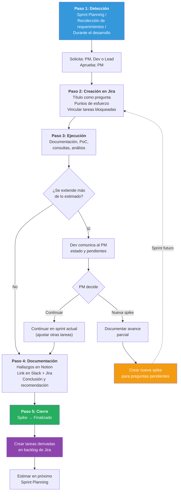

# Spikes — Tareas de Investigación

> [Volver al índice](README.md) · Flujo principal: [Proyecto en Desarrollo](02-flujo-proyecto-desarrollo.md)

Este documento define cómo gestionar **spikes** (tareas de investigación) en Tándem Digital, desde su detección hasta la creación de tareas derivadas.

---

## Qué es una Spike

Una **spike** es una tarea de investigación que se utiliza cuando el equipo enfrenta incertidumbre técnica o funcional y necesita obtener información antes de poder estimar o desarrollar una tarea.

A diferencia de una tarea de desarrollo convencional, el resultado de una spike no es código productivo ni una funcionalidad entregable al cliente. El resultado es **conocimiento**: documentación, decisiones técnicas, prototipos desechables o la información necesaria para que las tareas derivadas puedan estimarse y ejecutarse con claridad.

> **Principio clave:** Una spike existe para eliminar incertidumbre. Si el equipo puede estimar y desarrollar la tarea sin investigar primero, no es necesaria una spike.

---

## Cuándo usar una Spike

### Situaciones que justifican una spike

- **Tecnología desconocida**: Evaluar si una librería, framework o servicio externo es viable para el proyecto. Ejemplo: investigar si una librería de generación de PDF soporta los requisitos de formato del cliente.
- **Integración con sistemas externos**: Comprender la documentación, autenticación y endpoints de una API de terceros antes de estimar el desarrollo. Ejemplo: investigar la API de ARCA/AFIP para facturación electrónica.
- **Requisitos ambiguos o incompletos**: Cuando el cliente o el PM no pueden definir con precisión el comportamiento esperado y se necesita investigar reglas de negocio, normativas o comportamientos del dominio. Ejemplo: determinar qué campos son obligatorios para un formulario de alta según la normativa vigente del sector salud.
- **Estimación imposible**: Cuando el equipo no puede asignar puntos de historia porque desconoce la complejidad real del trabajo. Ejemplo: el cliente pide notificaciones en tiempo real pero el equipo nunca implementó WebSockets en la infraestructura actual.
- **Decisiones arquitectónicas de impacto**: Evaluar alternativas técnicas antes de comprometer una dirección. Ejemplo: comparar dos enfoques de almacenamiento de archivos clínicos (almacenamiento local vs. servicio cloud).
- **Migración o actualización tecnológica**: Investigar el impacto y la estrategia para migrar a una nueva versión de un framework o dependencia. Ejemplo: evaluar el esfuerzo de migrar de Vue 2 a Vue 3.5 en un proyecto en evolución.

### Situaciones que NO justifican una spike

- La tarea es compleja pero el equipo ya tiene experiencia con la tecnología involucrada. En ese caso, se estima con puntos altos (8 o 13) y se desarrolla directamente.
- El desarrollador quiere "probar algo" sin un objetivo concreto. Toda spike debe tener una pregunta específica a responder.
- Se usa como excusa para no comprometerse con una estimación. Si hay incertidumbre leve, se estima con un rango y se ajusta durante el sprint.

---

## Tipos de Spike

### Spike Técnica

Investiga aspectos de implementación, arquitectura, infraestructura o tecnología.

**Ejemplos concretos:**

- "¿Podemos usar WebSockets para notificaciones en tiempo real con nuestra infraestructura en producción?"
- "¿La librería X de generación de reportes PDF soporta tablas complejas con los requisitos del cliente?"
- "¿Qué cambios requiere nuestra base de datos SQL Server para soportar el nuevo módulo de auditoría?"
- "¿Es viable integrar firma digital en el flujo de documentos clínicos con la infraestructura actual?"

### Spike Funcional

Investiga requisitos, comportamiento esperado, reglas de negocio o normativas del dominio.

**Ejemplos concretos:**

- "¿Cuáles son los campos obligatorios para el formulario de alta según el área de compliance del hospital?"
- "¿Qué datos requiere la API de ARCA para generar una factura electrónica tipo C?"
- "¿Cómo funciona el flujo de aprobación de turnos en el sistema actual del cliente?"
- "¿Qué normativas de protección de datos de salud aplican a este proyecto y cómo afectan el diseño?"

---

## Cómo crear una Spike en Jira

### Configuración del tipo de tarea

Se recomienda crear un tipo de incidencia personalizado en Jira llamado **"Spike"** (o usar el tipo "Task" con la etiqueta `spike`). La tarea debe contener:

**Campos obligatorios:**

- **Título**: Debe ser una pregunta o un objetivo claro.
    - Correcto: `¿Es viable integrar con la API de ARCA para facturación electrónica?`
    - Incorrecto: `Investigar API`
- **Descripción**: Contexto del problema, por qué surge la necesidad de investigar y qué información se espera obtener.
- **Puntos de esfuerzo**: Estimación de la complejidad de la investigación usando la misma escala de Fibonacci que las demás tareas.
- **Criterios de finalización**: Lista de preguntas específicas que la spike debe responder (no confundir con criterios de aceptación funcionales).
- **Etiqueta**: `spike`.

**Campos opcionales:**

- **Épica vinculada**: Si la spike está relacionada con una funcionalidad mayor, vincularla a la épica correspondiente.
- **Tareas bloqueadas**: Si hay tareas que no pueden estimarse sin el resultado de la spike, vincularlas con relación "bloquea a".

### Ejemplo completo de una Spike en Jira

```
Título: Investigar integración con API de ARCA para facturación electrónica

Tipo: Spike (o Task con etiqueta "spike")
Etiqueta: spike
Épica: Módulo de Facturación
Puntos de esfuerzo: 5
Asignado a: [Desarrollador]

Descripción:
El cliente necesita generar facturas electrónicas tipo C desde el sistema.
Actualmente no tenemos experiencia con la API de ARCA.
Necesitamos investigar antes de poder estimar las tareas
del módulo de facturación.

Criterios de finalización:
- ¿Qué tipo de autenticación usa la API? (certificado digital, token, etc.)
- ¿Cuáles son los endpoints principales para emisión de facturas tipo C?
- ¿Existe un ambiente de testing/sandbox para desarrollo?
- ¿Qué datos mínimos requiere una factura para ser válida?
- ¿Hay limitaciones de rate-limiting o cuotas?
- ¿Existe alguna librería de Node.js o documentación no oficial que facilite
  la integración?

Resultado esperado:
Documento en Notion con los hallazgos y recomendación técnica.
Tareas derivadas creadas en Jira si la investigación concluye
que la integración es viable.
```

---

## Flujo de trabajo de una Spike

### Paso 1: Detección de la necesidad

La necesidad de una spike puede surgir en distintos momentos:

- **Durante la planificación del sprint (Sprint Planning)**: El equipo intenta estimar una tarea y no puede porque hay demasiada incertidumbre.
- **Durante la recolección de requerimientos**: El PM detecta que un requerimiento del cliente implica una tecnología o integración que el equipo desconoce.
- **Durante el desarrollo**: Un desarrollador encuentra que la tarea asignada depende de algo que nadie investigó previamente.

**¿Quién puede solicitar una spike?**

- El **PM** cuando detecta incertidumbre funcional o necesita validar viabilidad antes de comprometer alcance con el cliente.
- El **desarrollador** cuando identifica que no puede estimar o desarrollar sin investigar primero.
- El **líder técnico** cuando detecta riesgos técnicos o arquitectónicos.

**¿Quién aprueba la creación de la spike?**

El **PM**, ya que toda tarea que entra al sprint o al backlog debe ser aprobada por el PM (consistente con el principio de [Cambios de Alcance](03-gestion-cambios-alcance.md): "El PM es el único responsable de evaluar, decidir y comunicar").

### Paso 2: Creación y planificación

1. El PM (o quien detectó la necesidad, con aprobación del PM) crea la spike en Jira siguiendo el formato descrito arriba.
2. Se estima con **puntos de esfuerzo** en la reunión de planificación, junto con el equipo de desarrollo (igual que cualquier otra tarea).
3. Se vinculan las tareas bloqueadas, si las hay.
4. Se decide cuándo se ejecuta:
    - Si bloquea tareas del sprint actual, entra en el sprint actual.
    - Si es para un sprint futuro, se deja en el backlog priorizada.

### Paso 3: Ejecución

1. El desarrollador toma la spike y pasa la tarea a **En Progreso** (manualmente, ya que las spikes no requieren crear rama en GitHub).
2. Investiga según la complejidad estimada. Puede incluir:
    - Lectura de documentación.
    - Pruebas de concepto (prototipos desechables).
    - Consultas a proveedores o equipos externos.
    - Análisis de código existente.
    - Uso de IA (Claude, Cursor) como asistente de investigación.
3. **Si la investigación se extiende más de lo estimado:**
    - El desarrollador comunica al PM el estado y qué falta por resolver.
    - El PM decide si se continúa en el sprint actual (ajustando otras tareas si es necesario) o si se crea una nueva spike con las preguntas pendientes para un sprint futuro.
    - Se documenta lo encontrado hasta el momento para no perder el avance.

### Paso 4: Documentación de resultados

Al finalizar la spike, el desarrollador debe generar un documento con los hallazgos. Este documento se crea en **Notion** y debe incluir:

- **Pregunta original**: Qué se buscaba responder.
- **Hallazgos**: Lo que se descubrió durante la investigación.
- **Conclusión o recomendación**: Respuesta a la pregunta y enfoque recomendado.
- **Riesgos identificados**: Obstáculos, limitaciones o dependencias descubiertas.
- **Tareas derivadas sugeridas**: Qué tareas se pueden crear ahora y con qué estimación aproximada.
- **Referencias**: Links a documentación, repositorios de ejemplo, o prototipos creados.

**Dónde se registra:**

- El documento completo se publica en **Notion**, en la sección del proyecto.
- Se comparte el link en **Slack**, en el canal del proyecto.
- En la tarea de Jira se agrega un comentario con el link al documento de Notion y un resumen breve de la conclusión.

### Paso 5: Cierre y tareas derivadas

1. La spike se pasa a estado **Finalizado** en Jira.
2. El PM crea las **tareas derivadas** en el backlog de Jira con la información obtenida.
3. Las tareas derivadas se estiman en la próxima reunión de planificación (Sprint Planning), ahora con la información necesaria para hacerlo con precisión.
4. Se eliminan las relaciones de bloqueo si las tareas bloqueadas ya pueden avanzar.

### Diagrama del flujo de una Spike



---

## Spike en Scrum vs Kanban

Siguiendo la clasificación de [tipos de proyecto](01-marco-general.md#tipos-de-proyecto):

| Tipo de proyecto | Metodología | Tratamiento de la Spike |
|------------------|-------------|-------------------------|
| **Desarrollo** | Scrum (Sprints) | Se incluye en el sprint con sus puntos de esfuerzo. Consume capacidad del sprint como cualquier otra tarea. |
| **Evolución** | Kanban | Entra como cualquier otra tarea en el tablero Kanban, respetando el límite de trabajo en progreso (WIP limit: cantidad máxima de tareas simultáneas en progreso). Se estima con puntos para medir esfuerzo. |
| **Mantenimiento** | Kanban simplificado | Poco frecuente. Si surge, se trata igual que en Kanban. |

---

## Puntos de esfuerzo en Spikes

Las spikes se estiman con **puntos de esfuerzo usando la misma escala de Fibonacci** que las demás tareas del proyecto. La estimación la hace el equipo de desarrollo durante la reunión de planificación, igual que con cualquier otra tarea.

**Escala de referencia para spikes:**

| Puntos | Tipo de investigación |
|--------|----------------------|
| 1 | Investigación mínima. Consultar documentación puntual o verificar un dato concreto. |
| 2 | Investigación simple. Leer documentación de una API, probar un endpoint o validar una configuración. |
| 3 | Investigación moderada. Explorar una tecnología nueva, hacer pruebas de concepto básicas. |
| 5 | Investigación compleja. Evaluar alternativas técnicas, probar integraciones con dependencias reales. |
| 8 | Investigación muy compleja. Múltiples tecnologías involucradas, requiere coordinación con terceros. |
| 13+ | Demasiado grande. Debe dividirse en spikes más pequeñas y enfocadas. |

> **Regla:** Si una spike se estima en 13 o más puntos, es señal de que el objetivo no está suficientemente acotado. Se debe dividir en spikes más pequeñas, cada una con su propia pregunta a responder.

**¿Se cuentan los puntos de las spikes para la velocidad del equipo?**

Se recomienda **no contarlos para la velocidad**, ya que las spikes no producen funcionalidad entregable. Sin embargo, sí consumen capacidad del sprint. Para manejar esto:

- Se asignan puntos para que la spike ocupe su lugar en la capacidad del sprint (evitando sobrecargar al equipo).
- Se etiqueta con `spike` para que los reportes de velocidad puedan filtrarlas.
- De esta forma, la **velocidad** del equipo refleja solo el trabajo productivo entregado, mientras que la **capacidad** del sprint sí considera el esfuerzo dedicado a investigación.

---

## Reglas y buenas prácticas

### Obligatorias

1. **Toda spike debe tener un objetivo claro.** Formulado como pregunta o como lista de preguntas a responder.
2. **Toda spike debe estimarse con puntos de esfuerzo.** Se estima en la reunión de planificación junto con el equipo, igual que las demás tareas.
3. **El resultado debe documentarse.** Aunque la conclusión sea "no es viable", el conocimiento debe quedar registrado en Notion.
4. **Las tareas derivadas deben crearse en Jira.** El conocimiento obtenido se traduce en tareas estimables.
5. **No se desarrolla código productivo en una spike.** Si durante la investigación se genera un prototipo, este es desechable. El código productivo se desarrolla en las tareas derivadas, siguiendo el flujo normal (rama, PR, revisión).

### Recomendadas

1. **Definir el objetivo como pregunta.** Es más fácil saber cuándo la spike terminó si la formulamos como "¿Es viable X?" en lugar de "Investigar X".
2. **Comunicar hallazgos parciales.** Si la spike se extiende varios días, compartir avances en Slack para que el PM pueda tomar decisiones tempranas.
3. **Involucrar al PM en la conclusión.** Antes de cerrar la spike, revisar los hallazgos con el PM para alinear las tareas derivadas con las prioridades del proyecto.
4. **No extender spikes sin comunicación al PM.** Si la investigación se está extendiendo más de lo estimado, el desarrollador debe comunicarlo para que el PM evalúe el impacto en el sprint.
5. **Usar IA como acelerador de la investigación.** Claude y Cursor pueden ayudar a analizar documentación, explorar APIs y generar prototipos rápidos durante la spike.
6. **Dividir spikes grandes.** Si durante la estimación el equipo percibe que una spike es demasiado amplia (8+ puntos), dividirla en spikes más pequeñas con preguntas específicas.

---

## Relación con cambios de alcance

Una spike puede generar información que revele cambios de alcance. En ese caso, se aplica el proceso documentado en [Gestión de Cambios de Alcance](03-gestion-cambios-alcance.md):

- Si la spike revela que el alcance original era insuficiente o incorrecto, el PM evalúa y clasifica el cambio (aclaración menor, cambio pequeño, cambio grande).
- Si la spike demuestra que algo no es viable, el PM comunica al cliente y se redefine el alcance.
- En ningún caso el desarrollador modifica el alcance por su cuenta basándose en los hallazgos de la spike. El PM es quien toma esas decisiones.

---

## Ejemplo práctico completo

### Contexto

El proyecto "SaludNet" (tipo Desarrollo, Scrum) requiere integrar facturación electrónica con ARCA. El equipo no tiene experiencia previa con esta API.

### Sprint Planning

Durante la reunión de planificación, el equipo no puede estimar las tareas de facturación. Se decide crear una spike. El equipo la estima en **5 puntos de esfuerzo** (investigación compleja: API desconocida, autenticación por certificado, múltiples endpoints a explorar).

### Spike en Jira

```
Título: Investigar integración con API de ARCA para facturación electrónica
Puntos de esfuerzo: 5 (no se cuentan para velocidad)
Etiqueta: spike
Bloquea: SALUD-45 (Generar factura tipo C), SALUD-46 (Consultar estado de factura)
```

### Ejecución

El desarrollador investiga la API de ARCA. Usa Claude para analizar la documentación, prueba llamadas al sandbox y documenta los endpoints. Completa la investigación respondiendo todas las preguntas planteadas en los criterios de finalización.

### Resultado

Documento en Notion con:

- Autenticación: certificado digital + token temporal.
- Endpoints principales identificados y documentados.
- Sandbox disponible con datos de prueba.
- Limitación encontrada: la API tiene un rate-limit de 100 llamadas/minuto.
- Recomendación: usar la librería `afip.js` para Node.js que simplifica la autenticación.

### Tareas derivadas

- SALUD-45 se re-estima en 5 puntos (antes no se podía estimar).
- SALUD-46 se re-estima en 3 puntos.
- Se crea SALUD-52: "Configurar certificado digital de ARCA en ambiente de producción" (2 puntos).
- Se crea SALUD-53: "Implementar manejo de rate-limiting en módulo de facturación" (3 puntos).

### Cierre

La spike se cierra como **Finalizado**. Las tareas derivadas se priorizan para el próximo sprint.

---

## Resumen

| Aspecto | Detalle |
|---------|---------|
| **Qué es** | Tarea de investigación para reducir incertidumbre |
| **Resultado** | Conocimiento documentado, no código productivo |
| **Quién la solicita** | PM, desarrollador o líder técnico |
| **Quién la aprueba** | El PM |
| **Dónde se registra** | Jira (tarea) + Notion (documentación de hallazgos) + Slack (comunicación) |
| **Estimación** | Puntos de esfuerzo (Fibonacci), estimados por el equipo en planificación |
| **Velocidad** | Los puntos no se cuentan para la velocidad, sí para la capacidad |
| **Etiqueta en Jira** | `spike` |
| **Qué sigue** | Crear tareas derivadas estimables en el backlog |

---

## Documentos relacionados

| Documento | Relación |
|-----------|----------|
| [Gestión de Cambios de Alcance](03-gestion-cambios-alcance.md) | Una spike puede revelar cambios de alcance que se gestionan según ese proceso. |
| [Tareas Técnicas No Visibles](06-tareas-tecnicas.md) | Una spike puede concluir que se necesita una tarea técnica como paso previo. |
| [Marco General](01-marco-general.md) | Tipos de proyecto y metodologías que determinan cómo se planifica la spike. |
