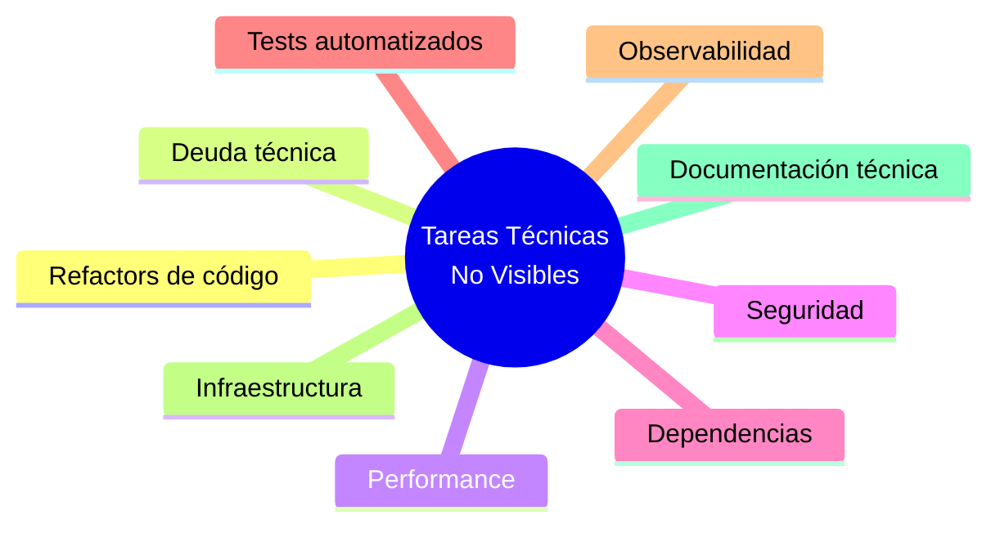
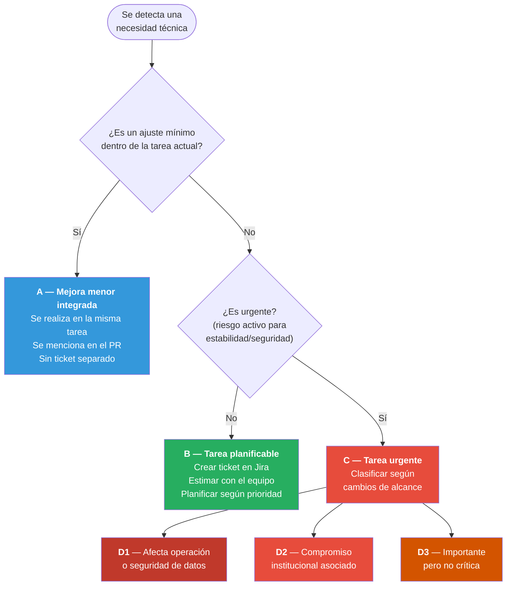

# Tareas Técnicas No Visibles para el Cliente

> [Volver al índice](README.md) · Flujo principal: [Proyecto en Desarrollo](02-flujo-proyecto-desarrollo.md)

Este documento define cómo debe proceder el equipo de Tándem Digital ante **tareas técnicas no visibles para el cliente**, asegurando que se planifiquen, ejecuten y comuniquen de forma controlada, sin comprometer la capacidad del sprint ni la relación con el cliente.

---

## Principio base

> Las tareas técnicas no visibles son trabajo real. Aportan valor indirecto pero crítico al negocio. No deben realizarse sin planificación ni visibilidad, y no deben ocultarse ni camuflarse dentro de otras tareas.

El objetivo es:

- Mantener la salud técnica del sistema a lo largo del tiempo.
- Dar visibilidad al equipo y al cliente sobre el esfuerzo dedicado a la estabilidad y escalabilidad.
- Evitar la acumulación descontrolada de deuda técnica.
- Garantizar trazabilidad de todo el trabajo realizado, incluso el que no genera funcionalidades nuevas.

El **PM coordina** el proceso: decide cuándo se incluyen estas tareas, comunica al cliente y controla el impacto en el sprint. El **desarrollador propone y ejecuta** las tareas técnicas con la calidad y responsabilidad habituales. El **líder técnico** interviene cuando las decisiones tienen impacto arquitectónico o afectan múltiples módulos.

---

## 1. Qué son las tareas técnicas no visibles

Son actividades necesarias para mantener la calidad, estabilidad y escalabilidad del sistema, pero que no generan funcionalidades nuevas perceptibles en la interfaz o el comportamiento inmediato del producto.

**Categorías comunes:**

- **Refactors de código**: Reestructuración interna para mejorar legibilidad, mantenibilidad o reducir acoplamiento, sin cambiar el comportamiento externo.
- **Reducción de deuda técnica**: Corrección de decisiones técnicas que se tomaron como atajos y que generan fricción o riesgo a mediano plazo.
- **Mejoras de performance**: Optimización de consultas, carga de páginas, consumo de memoria o tiempos de respuesta.
- **Seguridad**: Actualización de configuraciones, corrección de vulnerabilidades conocidas, mejoras en autenticación o manejo de datos sensibles.
- **Actualización de dependencias**: Actualizar librerías, frameworks o herramientas a versiones más recientes y estables.
- **Tests automatizados**: Creación o mejora de tests unitarios, de integración o end-to-end para cubrir funcionalidades existentes.
- **Observabilidad y monitoreo**: Implementación o mejora de logs, alertas, métricas de performance o herramientas de diagnóstico.
- **Infraestructura y configuración**: Mejoras en el entorno de despliegue, configuración de servidores, pipelines de CI/CD o ambientes de desarrollo.
- **Documentación técnica**: Actualización de documentación de arquitectura, diagramas, guías de setup o decisiones técnicas.



---

## 2. Detección y propuesta

### ¿Quién puede detectar la necesidad?

- **El desarrollador**: Durante el desarrollo de una tarea funcional, identifica código que necesita mejora, dependencias desactualizadas o problemas de performance.
- **El líder técnico**: Durante revisiones de código, análisis de arquitectura o al evaluar el estado general del proyecto.
- **El PM**: Al detectar problemas recurrentes reportados por el cliente (lentitud, errores intermitentes) que tienen raíz técnica.
- **Post-mortem de bugs**: Como acción preventiva derivada de un análisis post-mortem. Ver [Bugs en Producción](04-bugs-produccion.md).

### ¿Cómo se propone?

1. Quien detecta la necesidad **primero comunica la situación en Slack**, en el canal del proyecto, describiendo brevemente qué se detectó y por qué es importante.
2. El PM evalúa la propuesta y decide si se procede.
3. Si la tarea tiene impacto arquitectónico o afecta múltiples módulos, se consulta al líder técnico.
4. Con la aprobación del PM, se **crea la tarea en Jira** con la información necesaria.

**Reglas:**

- **Primero Slack, después Jira.** Se comunica la necesidad al equipo y al PM antes de crear el ticket. Esto permite evaluar la prioridad y evitar tareas innecesarias.
- **No se ejecuta sin ticket en Jira.** Aunque la mejora parezca pequeña y rápida, primero se registra.
- **No se mezcla con tareas funcionales.** Si durante el desarrollo de una feature el desarrollador detecta una mejora técnica necesaria, debe crear una tarea separada en el backlog. La excepción son ajustes mínimos que son parte natural del desarrollo (ver sección de clasificación).
- **No se decide unilateralmente.** El desarrollador propone, el PM decide cuándo y cómo se aborda.

---

## 3. Registro en Jira

El PM (o quien detecte la necesidad, con aprobación del PM) crea una tarea en Jira con la siguiente información:

### Campos obligatorios

- **Tipo**: `Tech Task`. Con que la tarea sea de este tipo ya es suficiente para identificarla como tarea técnica; no es necesario agregar etiquetas adicionales.
- **Título**: Descripción clara y específica de la mejora técnica. Lo importante es que sea descriptivo y no genérico.
    - Correcto: `Refactor del módulo de autenticación para reducir acoplamiento`
    - Correcto: `Actualizar dependencias del frontend a últimas versiones estables`
    - Incorrecto: `Mejoras varias`
    - Incorrecto: `Deuda técnica`
- **Descripción**: Se recomienda incluir la siguiente información para que la tarea sea clara, aunque no es obligatorio seguir este formato al pie de la letra. Lo importante es que quien tome la tarea pueda entender qué hacer y por qué:
    - **Qué se va a hacer**: Descripción técnica de la tarea.
    - **Por qué es necesario**: Qué problema actual resuelve o qué riesgo previene.
    - **Qué riesgo se evita o qué mejora se obtiene**: Impacto concreto de no realizarla y beneficio esperado.
    - **Alcance**: Qué archivos, módulos o áreas del sistema se ven afectados.
- **Puntos de historia**: Estimación usando la escala de Fibonacci, igual que cualquier otra tarea.

### Campos opcionales

- **Épica vinculada**: Si la tarea está relacionada con un módulo o funcionalidad específica.
- **Tareas relacionadas**: Si la mejora técnica surge de un bug, de un post-mortem o de una spike, vincular la tarea de origen.

### Ejemplo completo de una tarea técnica en Jira

```
Título: Refactor del módulo de autenticación para reducir acoplamiento

Tipo: Tech Task
Épica: Módulo de Autenticación
Puntos de historia: 5
Asignado a: [Desarrollador]

Descripción:
Reestructurar el módulo de autenticación separando la lógica de
validación de credenciales, la gestión de tokens y el manejo de
sesiones en servicios independientes. Actualmente todo está en
un único archivo de 800 líneas con alta dependencia cruzada.

El acoplamiento actual hace que cualquier cambio en la autenticación
requiera modificar y probar múltiples flujos no relacionados.
En los últimos 3 sprints, 2 bugs de producción se originaron por
cambios colaterales en este módulo.

Beneficio esperado:
- Reducir la probabilidad de bugs colaterales al modificar la autenticación.
- Facilitar la implementación futura del login con SSO que el cliente
  solicitó para el próximo trimestre.

Alcance:
- Archivos afectados: auth.service.js, session.middleware.js, token.utils.js
- Módulos relacionados: Login, Dashboard (verificación de sesión)

Criterios de aceptación:
- La funcionalidad de login, logout y verificación de sesión sigue
  funcionando exactamente igual que antes.
- El código de autenticación está separado en al menos 3 archivos
  con responsabilidades claras.
- No se introducen cambios en el comportamiento visible del sistema.
- Los tests existentes siguen pasando sin modificación.

Tarea relacionada: PROJ-89 (post-mortem del bug de sesiones duplicadas)
```

---

## 4. Clasificación del trabajo técnico

No todo el trabajo técnico requiere una tarea separada. El PM (con apoyo del líder técnico si es necesario) clasifica según el impacto:

### A. Mejora menor integrada al desarrollo

Son ajustes técnicos mínimos que surgen naturalmente durante el desarrollo de una tarea funcional y que no justifican una tarea separada.

**Ejemplos:**

- Renombrar una variable o función para mayor claridad dentro del archivo que ya se está modificando.
- Corregir un comentario desactualizado en el código que se está tocando.
- Extraer una función pequeña para evitar duplicación dentro del mismo archivo.

**Acción:**

- Se realiza dentro de la misma tarea funcional.
- Se menciona en la documentación del PR ("Además del feature, se realizó un ajuste menor de nomenclatura en X").
- No se crea tarea separada.
- No impacta los puntos de historia.

### B. Tarea técnica planificable

Son mejoras que requieren esfuerzo dedicado pero que no son urgentes. Representan la mayoría de las tareas técnicas.

**Ejemplos:**

- Refactor de un módulo completo.
- Actualización de dependencias del proyecto.
- Creación de tests automatizados para funcionalidades existentes.
- Mejoras de performance en consultas o carga de páginas.
- Implementación de logging o monitoreo.

**Acción:**

- Se crea tarea en Jira con la información completa.
- Se estima con el equipo en la reunión de planificación.
- Se planifica según la disponibilidad y las prioridades del proyecto (ver sección 5).

### C. Tarea técnica urgente

Son mejoras técnicas que no pueden esperar porque representan un riesgo activo para la estabilidad, seguridad o funcionamiento del sistema.

**Ejemplos:**

- Vulnerabilidad de seguridad descubierta en una dependencia.
- Problema de performance que está degradando la experiencia del usuario.
- Configuración incorrecta que puede provocar pérdida de datos.

**Acción:**

- Se trata como una urgencia, siguiendo la clasificación del documento de [Cambios de Alcance](03-gestion-cambios-alcance.md):
    - Si afecta operación o seguridad de datos: **urgencia crítica (D1)**.
    - Si tiene compromiso institucional asociado: **urgencia por compromiso (D2)**.
    - Si es importante pero no crítica: **urgencia operativa (D3)**.
- Se aplican las mismas reglas de interrupción del sprint, documentación y comunicación.

### Árbol de decisión para clasificar tareas técnicas



---

## 5. Planificación dentro del sprint

### Cuándo incluir tareas técnicas

Las tareas técnicas no visibles **no surgen en todos los sprints**. No es necesario reservar un porcentaje fijo de capacidad de forma permanente. La necesidad de incluirlas depende del momento y la etapa del proyecto.

**Según el tipo de proyecto:**

- **Desarrollo (Scrum):** Durante la construcción activa del proyecto es más probable que surjan necesidades técnicas (configuraciones iniciales, ajustes de arquitectura, actualización de dependencias). En esta etapa **es buena práctica dejar algo de espacio** en el sprint para este tipo de tareas cuando el equipo las identifique.
- **Evolución (Kanban):** Las tareas técnicas aparecen esporádicamente. Se agregan al backlog y se priorizan junto con las demás tareas, sin necesidad de reservar capacidad específica.
- **Mantenimiento (Kanban simplificado):** Ocurren con poca frecuencia. Cuando surgen (actualizaciones de seguridad, dependencias), entran al tablero como cualquier otra tarea.

> **Importante:** Si durante un sprint no surgen urgencias, la reserva de urgencias (20-25% según [Cambios de Alcance](03-gestion-cambios-alcance.md)) se puede aprovechar para tomar tareas técnicas del backlog o para adelantar features del próximo sprint.

### ¿Quién decide qué tareas técnicas entran?

El PM decide qué tareas técnicas entran al sprint, con la recomendación del líder técnico y del equipo de desarrollo. Durante la reunión de planificación del sprint (Sprint Planning):

1. El equipo de desarrollo presenta las tareas técnicas que considera prioritarias y explica por qué.
2. El líder técnico (si aplica) valida la prioridad técnica y el riesgo de postergar cada tarea.
3. El PM selecciona las tareas técnicas que entran al sprint según la capacidad disponible y la prioridad general del proyecto.

### Sprints de estabilización

En proyectos que han acumulado deuda técnica significativa, el PM puede decidir dedicar un sprint completo (o la mayor parte de uno) a tareas técnicas. Esto aplica cuando:

- La deuda técnica está ralentizando visiblemente el desarrollo de nuevas funcionalidades.
- Hay bugs recurrentes en módulos específicos que requieren refactorización.
- Se necesita una actualización mayor de tecnología (por ejemplo, migración de framework).
- El proyecto va a entrar en una fase de funcionalidades complejas y necesita una base sólida.

**Acción:**

- El PM comunica al cliente la necesidad del sprint de estabilización (ver sección de comunicación).
- Se planifica con el equipo qué tareas técnicas son prioritarias.
- Se documenta en Jira como un sprint con objetivo técnico específico.

---

## 6. Flujo de trabajo

### Paso 1: Propuesta

Quien detecta la necesidad la comunica en Slack, en el canal del proyecto. El PM evalúa y aprueba la creación de la tarea.

### Paso 2: Registro en Jira

Se crea la tarea siguiendo el formato descrito en la sección 3. Se estima con el equipo en la reunión de planificación.

### Paso 3: Desarrollo

El flujo de desarrollo es **idéntico al flujo estándar** descrito en [Proyecto en Desarrollo](02-flujo-proyecto-desarrollo.md):

1. El desarrollador toma la tarea y crea la rama desde Jira (la tarea pasa a **En Progreso**).
2. Desarrolla la mejora técnica, utilizando IA como asistente si corresponde.
3. Verifica que la funcionalidad existente no se haya roto. Esto es especialmente crítico en tareas técnicas, ya que por definición no cambian el comportamiento visible pero pueden introducir regresiones.
4. Resuelve conflictos si los hay (siguiendo las reglas del flujo estándar).

### Paso 4: Pull Request

Se crea el PR vinculado a Jira, igual que cualquier otra tarea. En la descripción del PR incluir:

- Qué se mejoró técnicamente.
- Qué archivos o módulos se modificaron.
- Cómo se verificó que no se introdujeron regresiones.
- Si hay algún riesgo o consideración especial para el deploy.

### Paso 5: Revisión

La revisión de tareas técnicas tiene una particularidad: el PM revisa que **la funcionalidad existente siga intacta** (no que haya una funcionalidad nueva). El foco de la revisión funcional es:

- Verificar que los flujos del módulo afectado siguen funcionando correctamente.
- Confirmar que no se introdujeron regresiones visibles.

Si la tarea es puramente técnica y no tiene impacto visible (por ejemplo, una actualización de dependencias o creación de tests), el PM puede delegar la revisión al líder técnico, quien valida la calidad técnica del cambio. En este caso:

- El líder técnico aprueba el PR desde el punto de vista técnico.
- El PM aprueba el cierre de la tarea en Jira.

### Paso 6: Merge y deploy

Se sigue el flujo estándar: merge a `desarrollo`, luego a `main` cuando se decida el deploy.

---

## 7. Vinculación con valor de negocio

Aunque el cliente no vea un cambio inmediato en la interfaz, el PM debe ser capaz de traducir el impacto técnico a valor de negocio. Esto es fundamental para la comunicación con el cliente y para justificar la asignación de capacidad.

**Tabla de traducción técnico a negocio:**

| Tarea técnica | Valor para el negocio |
|---------------|----------------------|
| Refactor de código | Permite avanzar más rápido en las próximas funcionalidades y reduce errores. |
| Reducción de deuda técnica | Previene bugs futuros y evita que el sistema se vuelva difícil de mantener. |
| Mejoras de performance | Los usuarios experimentan un sistema más rápido y fluido. |
| Seguridad | Protege los datos del cliente y sus usuarios. Reduce riesgo legal y reputacional. |
| Actualización de dependencias | Garantiza compatibilidad, seguridad y acceso a mejoras del ecosistema. |
| Tests automatizados | Reduce la cantidad de bugs que llegan a producción. Permite cambios con mayor confianza. |
| Observabilidad y monitoreo | Permite detectar y resolver problemas antes de que los usuarios los reporten. |
| Documentación técnica | Facilita que nuevos desarrolladores se integren al proyecto rápidamente. |

---

## 8. Comunicación con el cliente

### Principio de transparencia

Las tareas técnicas no se ocultan al cliente. El PM comunica su existencia y su valor de forma accesible, sin tecnicismos innecesarios.

### Cómo comunicarlo

**En reportes de sprint o entregas:**

El PM incluye las tareas técnicas realizadas, traducidas a valor de negocio.

Incorrecto:

> Se realizó un refactor del módulo de autenticación y se actualizaron las dependencias de Node.js a la versión 20.

Correcto:

> Se trabajó en mejoras internas del sistema que reducen la probabilidad de errores en el login y permiten avanzar más rápido en las próximas funcionalidades. También se realizaron actualizaciones de seguridad preventivas.

**En la planificación de sprints (cuando el cliente participa):**

El PM menciona que parte de la capacidad se destina a mantenimiento técnico, sin entrar en detalle a menos que el cliente pregunte.

Ejemplo:

> Este sprint incluye las funcionalidades X e Y, y además estamos dedicando una parte del tiempo a mejoras internas que mantienen el sistema estable y seguro.

### Manejo de objeciones del cliente

Si el cliente cuestiona la dedicación de tiempo a tareas técnicas:

1. **Explicar el riesgo de no realizarlas**: Describir concretamente qué puede pasar si se postergan (más bugs, sistema más lento, mayor costo de desarrollo futuro).
2. **Detallar el impacto a corto y mediano plazo**: Por ejemplo, "Si no actualizamos estas dependencias ahora, en 3 meses no podremos implementar la funcionalidad X que necesitan".
3. **Ofrecer opciones claras**:
    - Realizarlas en el sprint actual con la capacidad planificada.
    - Postergarlas, dejando explícito el riesgo asumido.
    - Reducir el alcance funcional del sprint para incluir las tareas técnicas prioritarias.
4. **Documentar la decisión**: Independientemente de lo que se decida, registrar en Jira y Notion la conversación y la decisión tomada.

> **Importante:** La decisión final es del cliente, pero siempre con información completa. El PM tiene la responsabilidad de informar adecuadamente. Si el cliente decide postergar una tarea técnica, el riesgo queda documentado.

---

## 9. Tareas técnicas según el tipo de proyecto

Siguiendo la clasificación de [tipos de proyecto](01-marco-general.md#tipos-de-proyecto):

| Tipo de proyecto | Metodología | Tratamiento de tareas técnicas |
|------------------|-------------|-------------------------------|
| **Desarrollo** | Scrum (Sprints) | Es buena práctica incluir tareas técnicas en el sprint cuando el equipo las identifique. Se estiman y planifican junto con las features. |
| **Evolución** | Kanban | Entran al tablero Kanban respetando el límite de trabajo en progreso (WIP limit: cantidad máxima de tareas que pueden estar "En Progreso" simultáneamente, para evitar sobrecarga del equipo). Se priorizan junto con las demás tareas del backlog. |
| **Mantenimiento** | Kanban simplificado | Las tareas técnicas pueden ser la actividad principal del proyecto (actualizaciones de seguridad, dependencias). Se gestionan como cualquier otra tarea en el tablero. |

---

## 10. Qué NO se debe hacer

- **No realizar tareas técnicas sin ticket en Jira.** Toda mejora, por pequeña que parezca, debe quedar registrada si requiere esfuerzo dedicado.
- **No camuflar tareas técnicas dentro de features.** Esto distorsiona las estimaciones, oculta el esfuerzo real y dificulta la medición.
- **No consumir tiempo del equipo sin visibilidad.** El PM debe saber en todo momento qué está haciendo cada desarrollador.
- **No postergar indefinidamente las tareas técnicas.** La deuda técnica acumulada se cobra con intereses: más bugs, desarrollo más lento y mayor costo de mantenimiento.
- **No tratar las tareas técnicas como trabajo de segunda categoría.** Son parte integral del desarrollo profesional de software y deben revisarse con la misma rigurosidad que las features.
- **No usar tareas técnicas como excusa para evitar trabajo funcional.** El equilibrio entre trabajo técnico y funcional lo define el PM según las prioridades del proyecto.

---

## 11. Buenas prácticas recomendadas

1. **Mantener un backlog técnico visible.** Filtrar las tareas de tipo Tech Task y revisarlas periódicamente. El líder técnico debe mantenerlo actualizado.
2. **Priorizar por riesgo.** Las tareas que previenen problemas graves (seguridad, pérdida de datos, caídas del sistema) van antes que las mejoras de confort (refactors estéticos, optimizaciones menores).
3. **Aprovechar la reserva de urgencias.** Si durante un sprint no surgen urgencias, usar la capacidad remanente para tomar tareas técnicas del backlog.
4. **Vincular con valor de negocio siempre.** Toda tarea técnica en Jira debe explicar por qué es importante, no solo qué se va a hacer.
5. **Revisar en la retrospectiva.** Analizar cuántas tareas técnicas se completaron, cuántas se postergaron y si la deuda técnica del proyecto está creciendo o reduciéndose.
6. **Documentar decisiones de postergar.** Si el PM o el cliente deciden postergar una tarea técnica, registrar la decisión y el riesgo asumido en Jira. Esto protege al equipo si el riesgo se materializa.
7. **Usar sprints de estabilización cuando sea necesario.** No esperar a que la deuda técnica sea inmanejable para dedicar un sprint a limpiarla.

---

## Resumen del flujo

| Paso | Responsable | Acción |
|------|-------------|--------|
| **Detección** | Desarrollador, Líder Técnico o PM | Se comunica primero en Slack, canal del proyecto. |
| **Evaluación** | PM (con apoyo técnico) | Clasifica: mejora menor integrada, tarea planificable o tarea urgente. |
| **Registro** | PM | Crea Tech Task en Jira con descripción, justificación y estimación. |
| **Planificación** | PM + Equipo | Se incluye en el sprint si hay disponibilidad o se deja en backlog priorizada. |
| **Desarrollo** | Desarrollador | Flujo estándar: rama, desarrollo, pruebas de no-regresión, PR vinculado a Jira. |
| **Revisión** | PM o Líder Técnico | Verifica que no se introdujeron regresiones. Aprueba o rechaza el PR. |
| **Deploy** | PM + Dev | Sale a producción con el release del sprint (flujo estándar). |
| **Comunicación** | PM | Incluye en el reporte de sprint, traducido a valor de negocio. |

---

## Documentos relacionados

| Documento | Relación |
|-----------|----------|
| [Bugs en Producción](04-bugs-produccion.md) | Bugs recurrentes derivan en tareas técnicas. Las acciones del post-mortem generan tareas técnicas. |
| [Gestión de Cambios de Alcance](03-gestion-cambios-alcance.md) | Las tareas técnicas urgentes se clasifican como urgencias D1, D2 o D3. |
| [Spikes — Investigación](05-spikes-investigacion.md) | Una spike puede concluir que se necesita una tarea técnica como paso previo. |
| [Marco General](01-marco-general.md) | Distribución de capacidad del sprint y tipos de proyecto. |
