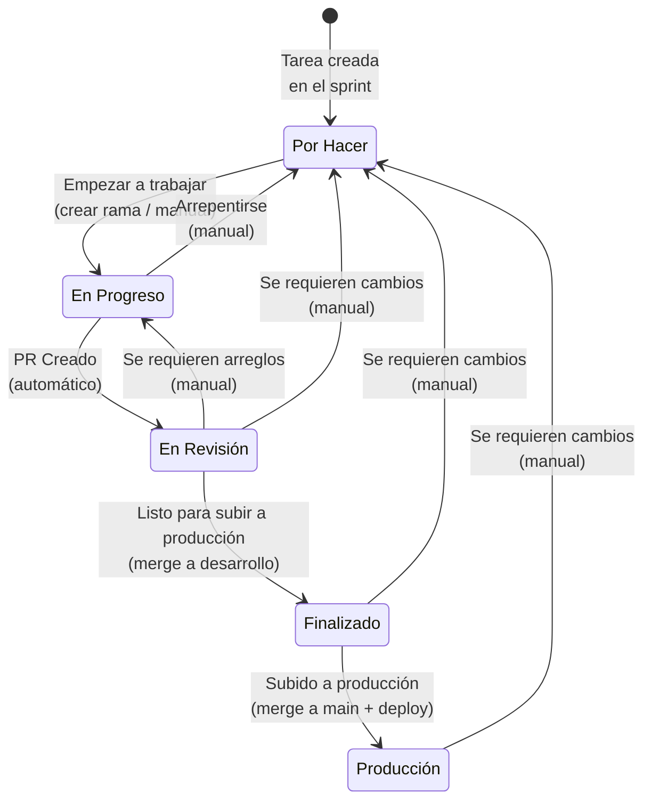
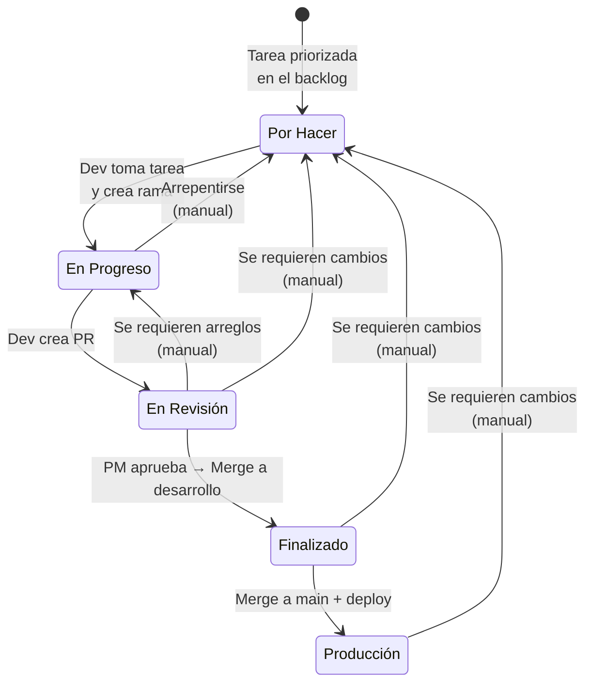
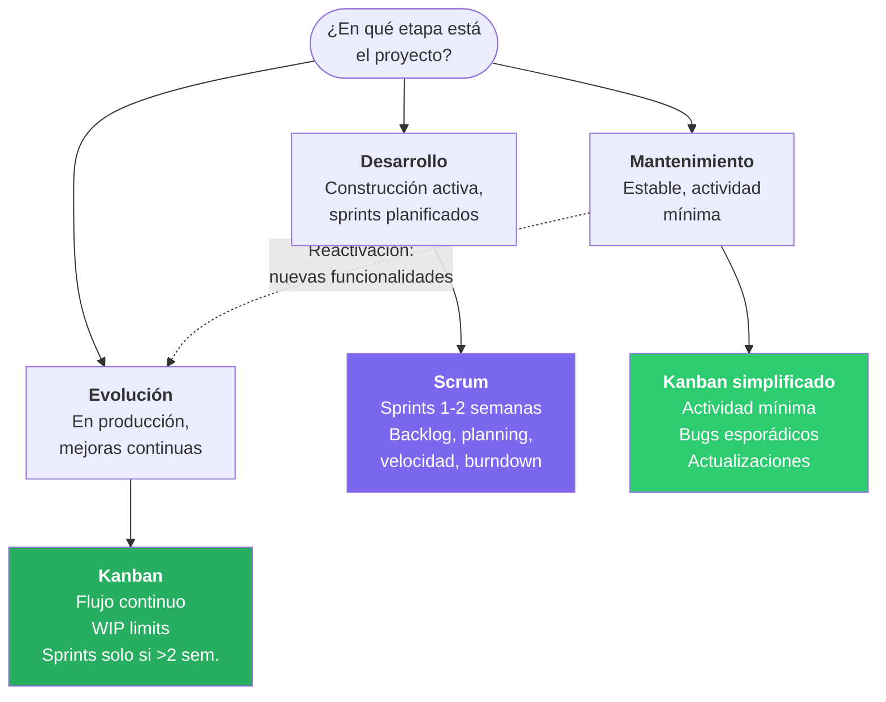

# Plantillas de Jira — Guía para Tándem Digital

> [Volver al índice](README.md)

Guía de configuración y uso de las plantillas de Jira Software en Tándem Digital. Define qué plantilla usar según el tipo de proyecto, los estados del tablero, los tipos de tarea y las etiquetas estándar.

---

## Plantillas utilizadas

Tándem Digital utiliza tres plantillas de Jira Software, una por cada tipo de proyecto:

| Plantilla | Tipo de proyecto | Metodología |
|-----------|-----------------|-------------|
| **Scrum** | Desarrollo | Sprints de 1-2 semanas, planificación, velocidad |
| **Kanban** | Evolución | Flujo continuo, WIP limits |
| **Kanban simplificado** | Mantenimiento | Actividad mínima, bugs esporádicos |

> Ver tipos de proyecto y su ciclo de vida en [Marco General](01-marco-general.md#tipos-de-proyecto).

---

## 1. Scrum — Proyectos en Desarrollo

Plantilla para proyectos en construcción activa con sprints de 1-2 semanas, planificación intensiva y fechas de entrega definidas.

**Cuándo usarla:**

- Proyectos con alcance cerrado por fase.
- Cuando se necesita predictibilidad en entregas.
- Equipos dedicados a un proyecto con planificación intensiva.

### Columnas del tablero

| Columna | Descripción | Transición |
|---------|-------------|------------|
| **Por Hacer** | Tareas incluidas en el sprint, listas para ser tomadas. | Estado inicial al crear la tarea. |
| **En Progreso** | El desarrollador está trabajando activamente en la tarea. | Automática al crear rama desde Jira. |
| **En Revisión** | El PM valida la funcionalidad contra los criterios de aceptación. | Automática al crear PR vinculado a Jira. |
| **Finalizado** | Tarea completada, código mergeado a desarrollo. | Automática al hacer merge del PR. |
| **Producción** | Código desplegado a producción (merge a main). | Manual al hacer merge a main + deploy. |

### Flujo de estados

### Automatización Jira-GitHub

| Acción en GitHub | Efecto en Jira |
|------------------|----------------|
| Crear rama desde Jira | Tarea → **En Progreso** |
| Crear PR con ID de tarea (ej. `PROJ-123`) | Tarea → **En Revisión** + PR vinculado |
| Merge del PR a `desarrollo` | Tarea → **Finalizado** |
| Merge a `main` + deploy | Tarea → **Producción** (manual) |

### Tipos de tarea utilizados

| Tipo | Uso | Etiqueta |
|------|-----|----------|
| **Task** | Funcionalidades visibles para el cliente. | — |
| **Bug** | Bugs de producción (P0-P3). | `production-bug`, `hotfix` (P0) |
| **Tech Task** | Deuda técnica, refactors, mejoras internas. | — (se identifica por el tipo) |
| **Spike** | Investigación técnica o funcional. | `spike` |
| **Subtask** | Trabajo derivado dentro de una tarea (ej. resolución de conflictos complejos). | — |

### Capacidad del sprint

| Concepto | Porcentaje |
|----------|------------|
| Trabajo planificado (features + tareas técnicas) | 75-80% |
| Reserva para urgencias | 20-25% |

> Las tareas técnicas no requieren reserva fija; es buena práctica incluirlas cuando el equipo las identifique. Ver [Tareas Técnicas](06-tareas-tecnicas.md).

### Campos requeridos por tipo de tarea

**Task:**

- Descripción clara (qué quiere el cliente y para qué).
- Alcance funcional (qué debe hacer y qué no).
- Archivos adjuntos (diseños, capturas, links a Notion).
- Criterios de aceptación (condiciones verificables para considerar la tarea completa).
- Puntos de historia (escala Fibonacci: 1, 2, 3, 5, 8, 13+).

**Bug:**

- Título descriptivo del problema (el tipo de tarea en Jira ya lo identifica como Bug).
- Comportamiento actual vs. comportamiento esperado.
- Módulo afectado y entorno (producción, staging).
- Pasos para reproducir.
- Evidencia (capturas, videos, logs).
- Prioridad (P0, P1, P2, P3).
- Etiqueta `production-bug` (siempre) + `hotfix` (solo P0).

**Tech Task:**

- Qué se va a hacer (descripción técnica).
- Por qué es necesario (problema que resuelve o riesgo que previene).
- Alcance (archivos, módulos, áreas afectadas).
- Puntos de historia.
- Tareas relacionadas (bug, post-mortem o spike de origen).

**Spike:**

- Título como pregunta u objetivo claro (el tipo de tarea en Jira ya lo identifica como Spike).
- Contexto y por qué se necesita investigar.
- Criterios de finalización (preguntas específicas a responder, no criterios funcionales).
- Puntos de historia (consumen capacidad del sprint pero no cuentan para velocidad).
- Etiqueta `spike`.
- Épica vinculada y tareas bloqueadas (opcional).

> Ver flujo Scrum completo en [Flujo de Proyecto en Desarrollo](02-flujo-proyecto-desarrollo.md).

---

## 2. Kanban — Proyectos en Evolución

Plantilla para proyectos ya productivos donde el cliente solicita mejoras, nuevas funcionalidades y corrección de bugs de forma continua.

**Cuándo usarla:**

- Proyectos en producción con desarrollo activo sobre una base estable.
- Desarrollo continuo donde el cliente va pidiendo mejoras incrementalmente.
- Solo se activan sprints si aparecen requerimientos grandes que superen las 2 semanas.

### Columnas del tablero

| Columna | Descripción |
|---------|-------------|
| **Por Hacer** | Backlog priorizado. Las tareas se toman en orden de prioridad. |
| **En Progreso** | El desarrollador está trabajando activamente. Respetar WIP limits. |
| **En Revisión** | El PM valida la funcionalidad. |
| **Finalizado** | Tarea completada, código mergeado a desarrollo. |
| **Producción** | Código desplegado a producción (merge a main). |

### WIP Limits

Las columnas **En Progreso** y **En Revisión** deben tener límites de trabajo en progreso configurados para evitar sobrecarga del equipo. El límite depende del tamaño del equipo (típicamente 2-4 tareas por columna).

### Flujo de estados

### Tipos de tarea utilizados

Los mismos que en Scrum: **Task**, **Bug**, **Tech Task**, **Spike**, **Subtask**. Las tareas técnicas se priorizan desde el backlog según necesidad.

### Campos requeridos

Mismos campos que en Scrum para cada tipo de tarea. La diferencia es operativa: no hay Sprint Planning formal, las tareas se toman del backlog en orden de prioridad.

---

## 3. Kanban simplificado — Proyectos en Mantenimiento

Plantilla para proyectos estables en producción sin nuevos requerimientos. Actividad mínima orientada a bugs esporádicos y actualizaciones de seguridad.

**Cuándo usarla:**

- Proyectos sin desarrollo activo.
- Trabajo limitado a corrección de bugs esporádicos.
- Actualizaciones de seguridad y mantenimiento general.

### Columnas del tablero

| Columna | Descripción |
|---------|-------------|
| **Por Hacer** | Bugs reportados o actualizaciones pendientes. |
| **En Progreso** | Trabajo activo (mínimo). |
| **Finalizado** | Código mergeado a desarrollo. |
| **Producción** | Resuelto y desplegado a producción. |

> En mantenimiento, la columna **En Revisión** puede omitirse si la actividad es muy baja y el PM valida directamente antes del merge.

### Tipos de tarea utilizados

Principalmente **Bug** y **Tech Task** (actualizaciones de dependencias, parches de seguridad). Rara vez **Task** o **Spike**.

---

## Selección de plantilla

### Tabla de referencia rápida

| Escenario | Plantilla |
|-----------|-----------|
| Proyecto nuevo con alcance definido | **Scrum** |
| Producto en producción con mejoras continuas | **Kanban** |
| Sistema estable sin nuevos requerimientos | **Kanban simplificado** |

### Árbol de selección

---

## Etiquetas estándar

Etiquetas comunes a todas las plantillas. Deben usarse de forma consistente en todos los proyectos.

| Etiqueta | Uso | Documento de referencia |
|----------|-----|------------------------|
| `production-bug` | Todos los bugs de producción | [Bugs en Producción](04-bugs-produccion.md) |
| `hotfix` | Bugs P0 que requieren deploy urgente | [Bugs en Producción](04-bugs-produccion.md) |
| `cambio-alcance` | Cambios de alcance generales | [Cambios de Alcance](03-gestion-cambios-alcance.md) |
| `urgencia-critica` | Urgencia D1: afecta operación, pacientes o seguridad | [Cambios de Alcance](03-gestion-cambios-alcance.md) |
| `urgencia-compromiso` | Urgencia D2: compromiso político o institucional | [Cambios de Alcance](03-gestion-cambios-alcance.md) |
| `urgencia-operativa` | Urgencia D3: importante pero no crítica | [Cambios de Alcance](03-gestion-cambios-alcance.md) |
| `spike` | Tareas de investigación | [Spikes](05-spikes-investigacion.md) |

> Las **Tech Tasks** se identifican por su tipo de tarea en Jira (`Tech Task`), no por etiqueta. Ver [Tareas Técnicas](06-tareas-tecnicas.md).

---

## Ramas en GitHub por tipo de tarea

La convención de ramas aplica a todas las plantillas y se integra con la automatización de estados en Jira.

| Tipo de rama | Origen | Destino | Patrón | Cuándo se usa |
|--------------|--------|---------|--------|---------------|
| `feature/PROJ-XXX` | `desarrollo` | `desarrollo` | Nueva funcionalidad | Tasks y Tech Tasks |
| `bugfix/PROJ-XXX` | `desarrollo` | `desarrollo` | Bugs P1, P2, P3 | Bugs que pueden esperar al sprint |
| `hotfix/PROJ-XXX` | `main` | `main` + `desarrollo` | Bug P0 crítico | Interrumpe el sprint, deploy inmediato |

> Ver detalle del flujo de ramas en [Flujo de Proyecto en Desarrollo](02-flujo-proyecto-desarrollo.md) y [Bugs en Producción](04-bugs-produccion.md).

---

## Consideraciones

1. **Consistencia entre proyectos:** Es más importante que todos los equipos usen las plantillas de forma consistente que tener la configuración perfecta.
2. **Integración GitHub:** La automatización de estados (rama → En Progreso, PR → En Revisión, merge → Finalizado) debe estar configurada en todos los proyectos.
3. **Sin trabajo sin ticket:** Toda tarea, por pequeña que sea, debe tener un ticket en Jira para mantener trazabilidad.
4. **Transición entre plantillas:** Cuando un proyecto cambia de etapa (Desarrollo → Evolución → Mantenimiento), se debe ajustar la plantilla del tablero según corresponda.

---

## Documentos relacionados

| Documento | Relación |
|-----------|----------|
| [Marco General](01-marco-general.md) | Tipos de proyecto que determinan qué plantilla usar. |
| [Flujo de Proyecto en Desarrollo](02-flujo-proyecto-desarrollo.md) | Flujo Scrum completo: estados, transiciones y automatización. |
| [Gestión de Cambios de Alcance](03-gestion-cambios-alcance.md) | Etiquetas de urgencia (`urgencia-critica`, `urgencia-compromiso`, `urgencia-operativa`). |
| [Bugs en Producción](04-bugs-produccion.md) | Clasificación P0-P3, etiquetas `production-bug` y `hotfix`. |
| [Spikes — Tareas de Investigación](05-spikes-investigacion.md) | Tipo Spike y etiqueta `spike`. |
| [Tareas Técnicas No Visibles](06-tareas-tecnicas.md) | Tipo Tech Task, clasificación A-B-C. |
